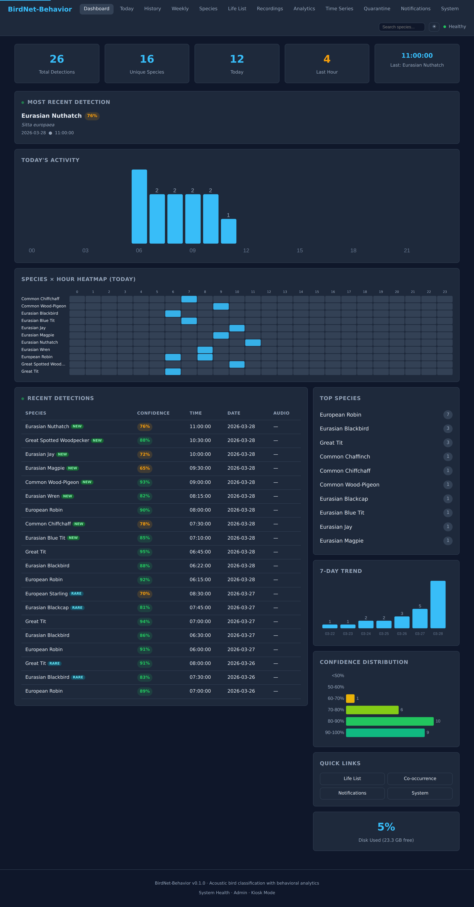
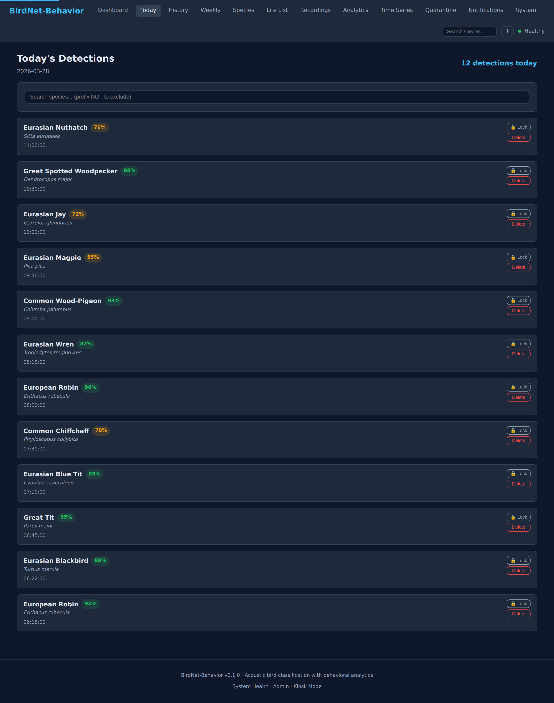
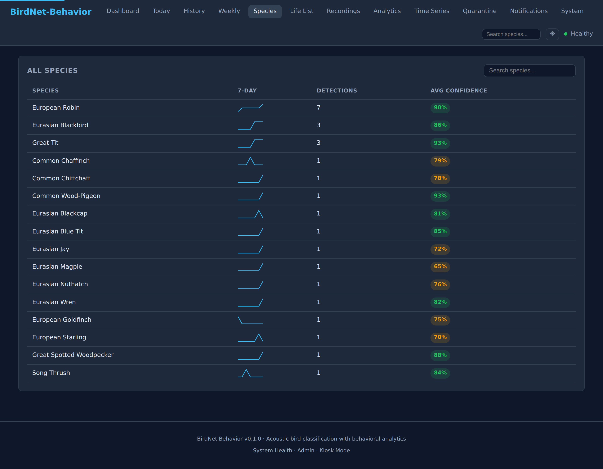
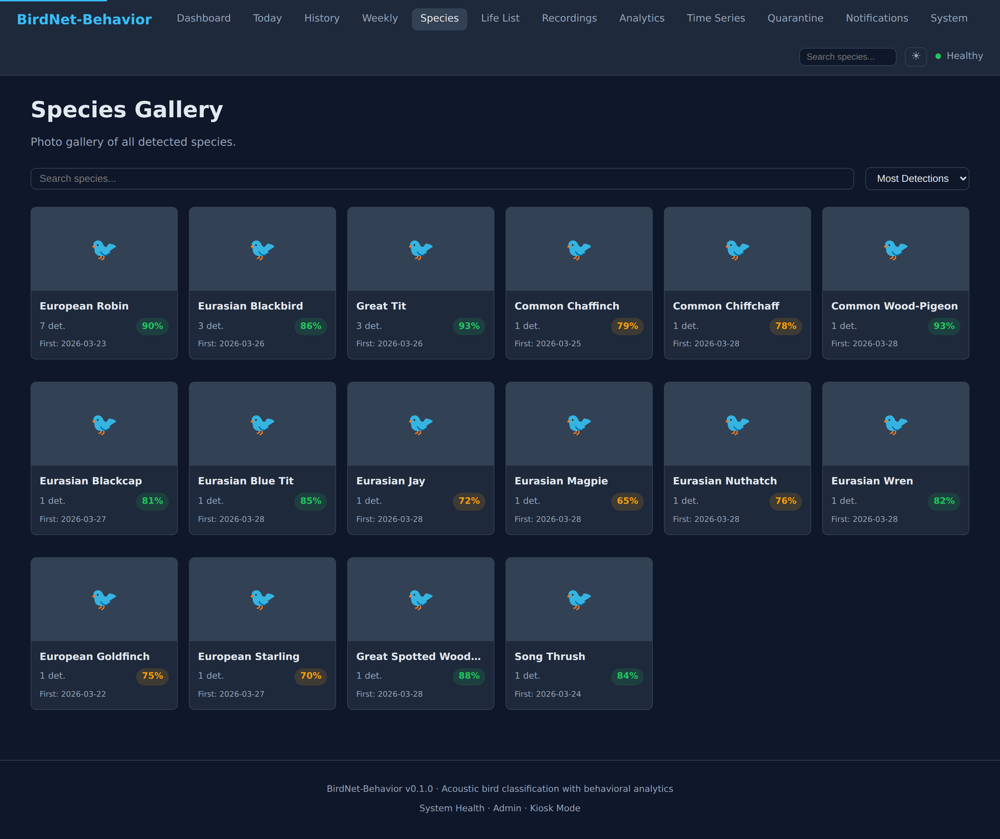
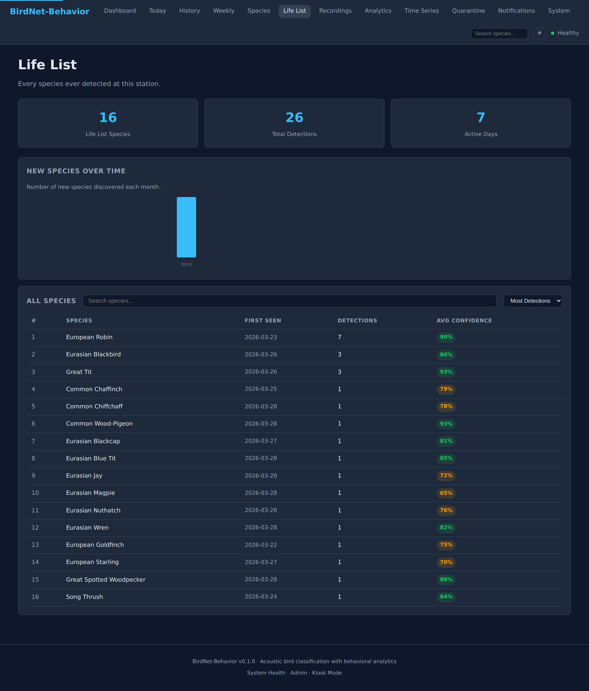
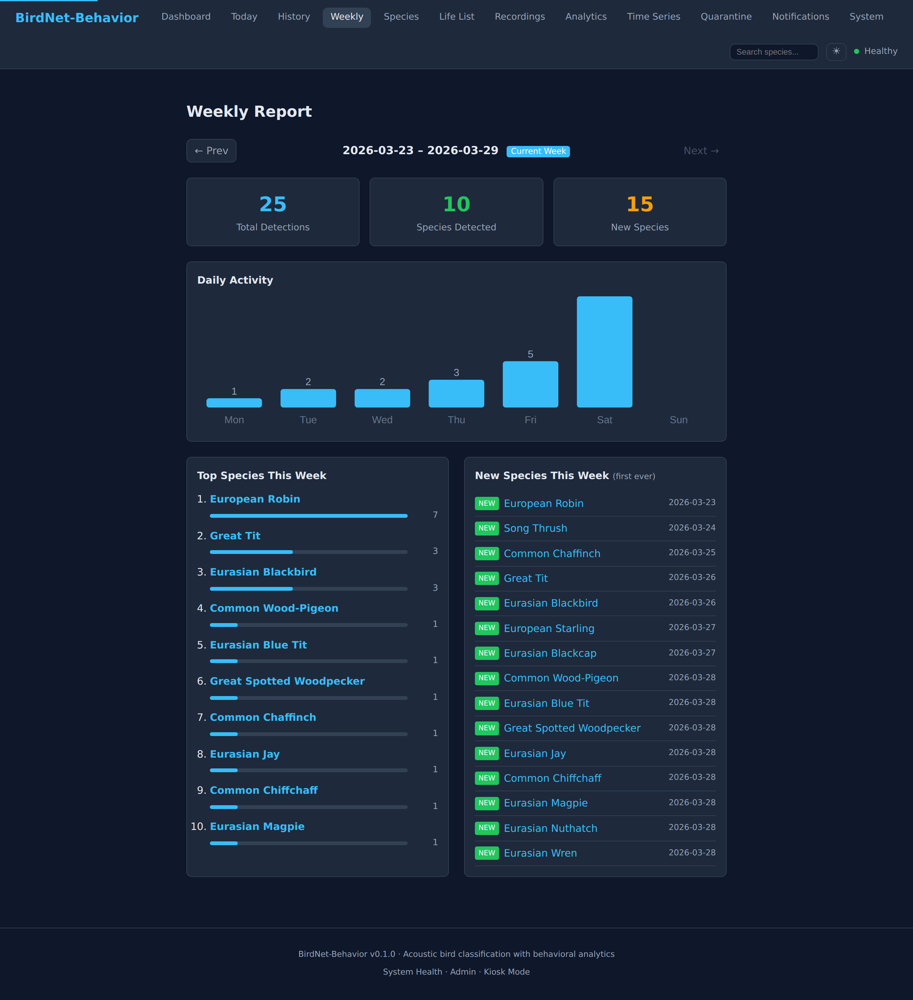
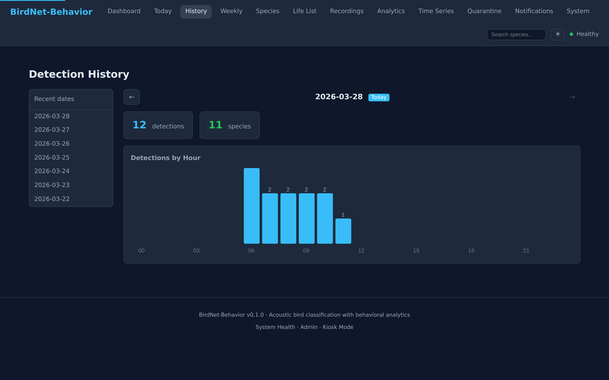
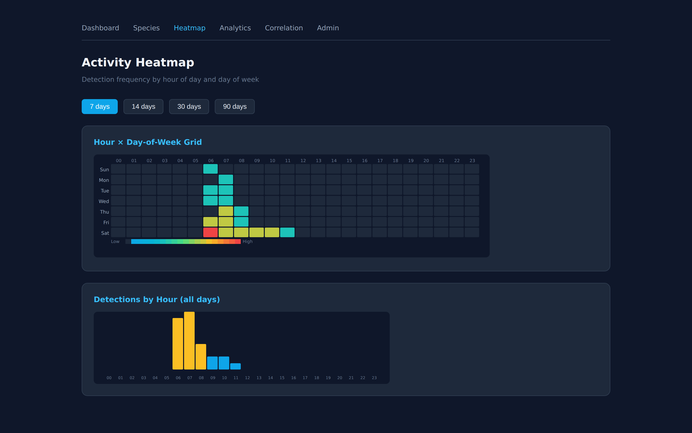
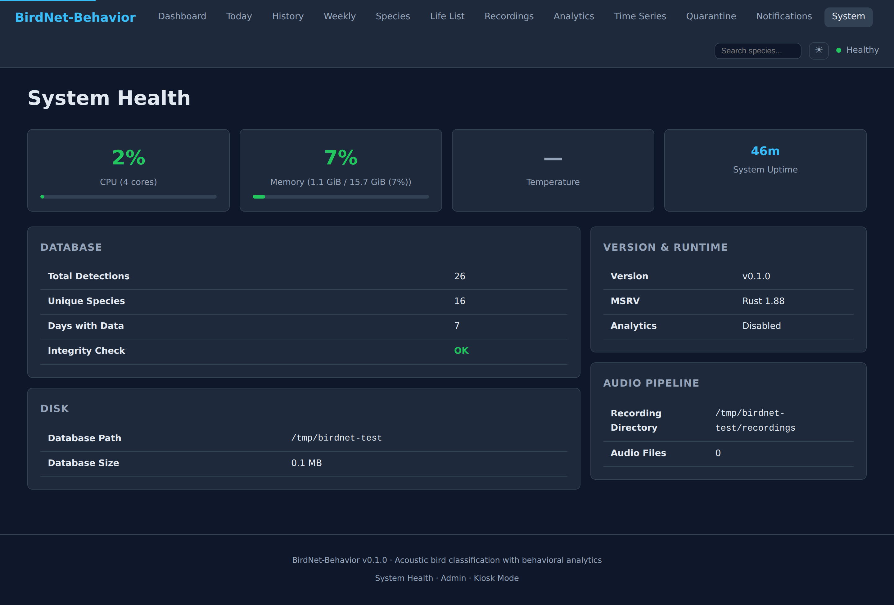

<h1 align="center">BirdNet-Behavior</h1>
<p align="center">Real-time acoustic bird classification with behavioral analytics — written in Rust, runs on a Raspberry Pi</p>

<p align="center">
  <a href="https://creativecommons.org/licenses/by-nc-sa/4.0/"></a>
  
  
  
  
</p>

> [!IMPORTANT]
> BirdNet-Behavior is licensed **CC BY-NC-SA 4.0** — the same terms as the upstream BirdNET model and BirdNET-Pi.
> **You may not use this project to build a commercial product.** See [LICENSE](LICENSE) for details.

---

**[Quick Install](#installation)** · **[Docker](#docker)** · **[Screenshots](#screenshots)** · **[Features](#features)** · **[Configuration](#configuration)** · **[Troubleshooting](#troubleshooting)**

---

## Screenshots

<details open>
<summary><strong>Dashboard</strong> — live detection feed, activity charts, species heatmap</summary>


</details>

<details>
<summary><strong>Today's Detections</strong> — searchable, paginated, with inline audio playback</summary>


</details>

<details>
<summary><strong>Species List</strong> — all detected species with sparklines and confidence</summary>


</details>

<details>
<summary><strong>Species Gallery</strong> — photo card grid with search and sort</summary>


</details>

<details>
<summary><strong>Life List</strong> — birding journal with first-seen dates and discovery timeline</summary>


</details>

<details>
<summary><strong>Weekly Report</strong> — top species, new discoveries, daily activity chart</summary>


</details>

<details>
<summary><strong>Detection History</strong> — date browser with hourly bar charts</summary>


</details>

<details>
<summary><strong>Activity Heatmap</strong> — hour x day-of-week SVG grid</summary>


</details>

<details>
<summary><strong>System Health</strong> — CPU, memory, temperature gauges, database integrity</summary>


</details>

> All pages support **dark and light themes** with automatic OS preference detection. The UI is fully responsive on mobile, tablet, and desktop.

---

## What is BirdNet-Behavior?

BirdNet-Behavior is a ground-up Rust rewrite of [BirdNET-Pi](https://github.com/mcguirepr89/BirdNET-Pi). It runs on a Raspberry Pi, listens to your microphone or RTSP camera, identifies birds in real time using the BirdNET+ neural network, and serves a web dashboard you open in any browser.

It ships as a **single static binary** — no Python, no pip, no virtualenv. Drop it on a Pi and run it.

| | BirdNET-Pi (Python) | BirdNet-Behavior (Rust) |
|---|---|---|
| Memory | 400-600 MB | ~20-50 MB |
| Cold start | 5-15 s | < 1 s |
| Dependencies | pip + venv + system libs | None |
| Upgrade | pip breakage, virtualenv rot | `scp` one file |
| Concurrency | GIL-constrained | Lock-free parallel audio |

---

## Requirements

| Platform | Status |
|---|---|
| Raspberry Pi 5 | Recommended |
| Raspberry Pi 4B / 400 | Fully supported |
| Any x86_64 Linux | Fully supported |
| Raspberry Pi 3B+ | Supported (native binary only, no Docker) |

**Storage:** ~1.5 GB free (541 MB for the BirdNET+ model, the rest for recordings and database).

**Audio input** (one of):
- USB microphone or USB sound card (`arecord` from `alsa-utils`)
- IP camera or any RTSP stream (`ffmpeg`)

---

## Installation

### Option 1: One-liner (Raspberry Pi / bare metal)

```bash
curl -fsSL https://raw.githubusercontent.com/tomtom215/BirdNet-Behavior/main/install.sh | sudo bash
```

The installer:
1. Detects your architecture (aarch64 / x86_64)
2. Downloads the pre-built binary from GitHub Releases
3. Downloads the BirdNET+ V3.0 model (~541 MB) from Zenodo
4. Creates config, recording, and model directories
5. Installs and enables a systemd service
6. Auto-detects your ALSA microphone
7. Starts the service immediately

```bash
# Install a specific version (defaults to latest)
VERSION=0.1.0 bash <(curl -fsSL https://raw.githubusercontent.com/tomtom215/BirdNet-Behavior/main/install.sh)

# Uninstall (recordings and database are preserved)
curl -fsSL https://raw.githubusercontent.com/tomtom215/BirdNet-Behavior/main/install.sh | sudo bash -s uninstall
```

### Option 2: Docker

See the [Docker section](#docker) below.

---

## Docker

### Quick start (3 commands)

```bash
git clone https://github.com/tomtom215/BirdNet-Behavior.git
cd BirdNet-Behavior
cp .env.example .env
# Edit .env — set at minimum BIRDNET_LATITUDE and BIRDNET_LONGITUDE
```

Then choose your audio source:

```bash
# RTSP camera or file-watch mode (no mic needed)
docker compose up -d

# USB microphone (Raspberry Pi, most Linux)
docker compose -f docker-compose.yml -f docker-compose.alsa.yml up -d

# PulseAudio / PipeWire (desktop Linux)
docker compose -f docker-compose.yml -f docker-compose.pulse.yml up -d
```

Open **http://localhost:8502** in your browser.

The BirdNET+ model (~541 MB) downloads automatically on first run. Subsequent starts are instant.

### Pre-built images

```bash
# Standard (no DuckDB analytics)
docker pull ghcr.io/tomtom215/birdnet-behavior:latest

# With behavioral analytics (DuckDB-powered)
docker pull ghcr.io/tomtom215/birdnet-behavior:latest-analytics
```

Available for `linux/amd64` and `linux/arm64`.

### USB microphone setup

```bash
# 1. Find your device on the host
arecord -l
# card 1: Device [USB Audio], device 0: USB Audio [USB Audio]

# 2. Test it works
arecord -D plughw:1,0 -d 3 /tmp/test.wav && aplay /tmp/test.wav

# 3. Set it in .env
echo "BIRDNET_ALSA_DEVICE=plughw:1,0" >> .env

# 4. Start with the ALSA overlay
docker compose -f docker-compose.yml -f docker-compose.alsa.yml up -d
```

### Build locally (instead of pulling)

```bash
# Standard build
docker compose build

# With DuckDB analytics (adds ~7 min for C++ compilation)
BUILD_FEATURES=analytics docker compose build
```

### Docker data layout

All persistent data lives in a single Docker volume at `/data`:

```
/data/
  model/        BirdNET+ ONNX model + labels (auto-downloaded)
  recordings/   Audio segments from the capture pipeline
  cache/        Wikipedia species image cache
  birdnet.db    SQLite detections database
  analytics.db  DuckDB behavioral analytics (optional)
```

### Compose files reference

| File | Purpose |
|---|---|
| `docker-compose.yml` | Base config — works for RTSP and file-watch mode |
| `docker-compose.alsa.yml` | Overlay for USB/ALSA microphone (passes `/dev/snd`) |
| `docker-compose.pulse.yml` | Overlay for PulseAudio/PipeWire (mounts PA socket) |
| `.env.example` | Documented template for all environment variables |
| `docker/entrypoint.sh` | Model download + container startup |

---

## First Steps

After starting (via installer or Docker), open the web dashboard:

```
http://<your-ip>:8502
```

> Not sure of your Pi's IP? Run `hostname -I` on the Pi, or check your router's device list.

1. Go to **`/admin/settings`** — set your latitude/longitude, confirm your audio source
2. Return to **`/`** — the dashboard shows live detections as they come in
3. Visit **`/species`** to browse all species detected so far

---

## Features

### Core (everything BirdNET-Pi does)

| Feature | Notes |
|---|---|
| Real-time detection | USB microphone or RTSP stream |
| BirdNET+ V3.0 model | Same accuracy as upstream |
| SQLite detection database | Full history, fast queries |
| Web dashboard | 18+ pages, dark/light theme, responsive |
| Per-species pages | Hourly activity, 14-day trend, companion species, Wikipedia image |
| Apprise notifications | Telegram, Slack, Discord, 80+ channels |
| BirdWeather uploads | Station API compatible |
| Email alerts | SMTP/STARTTLS, per-species cooldown |
| CSV / JSON export | Full detection history |
| Admin settings panel | All config via web UI |
| Database backup/restore | Download from web UI |
| HTTP Basic Auth | Caddy / `CADDY_PWD` compatible |

### New in BirdNet-Behavior

**Behavioral Analytics** (optional, requires `--features analytics`):
- Activity sessions, resident vs. migrant classification
- Dawn chorus validation, species co-occurrence correlation
- Migration phenology with weekly abundance index

**IoT / Home Automation:**
- Pure Rust MQTT 3.1.1 publishing (no external broker library)
- Home Assistant auto-discovery (`--mqtt-ha-discovery`)
- Compatible with Mosquitto, Node-RED, any MQTT 3.1.1 broker

**Additional pages and features:**
- Species photo gallery with search and sort
- Life list / birding journal with first-seen dates and discovery timeline
- System health dashboard (CPU, memory, temperature, database integrity)
- Notification center with channel stats
- Rare bird quarantine queue (approve / reject / delete)
- Hour x day-of-week activity heatmap (SVG)
- Species co-occurrence correlation matrix
- Audio quality pre-filtering (SNR, spectral flatness, rain/wind detection)
- Prometheus metrics at `/api/v2/metrics`
- Kiosk mode for dedicated display screens
- Live spectrogram WebSocket stream
- Custom audio player with spectrogram overlay

---

## Configuration

Settings are read in this priority order (highest wins):

```
CLI flags  >  environment variables  >  settings DB  >  /etc/birdnet/birdnet.conf  >  defaults
```

The easiest way to configure is through the **web UI at `/admin/settings`**.

### Key Settings

| Setting | Description | Default |
|---|---|---|
| `confidence_threshold` | Minimum confidence to record a detection | `0.70` |
| `sensitivity` | Detection sensitivity (0.5-1.5) | `1.0` |
| `alsa_device` | ALSA device for microphone input (`plughw:1,0`) | - |
| `rtsp_url` | RTSP stream URL | - |
| `latitude` / `longitude` | Station coordinates | - |
| `recording_days` | Days to retain audio files | `30` |
| `apprise_url` | Apprise server URL | - |
| `birdweather_token` | BirdWeather station token | - |
| `mqtt_host` | MQTT broker hostname | - |
| `mqtt_ha_discovery` | Home Assistant auto-discovery | `false` |
| `quality_filter` | Enable audio quality pre-filtering | `false` |

---

## Web UI

### Pages

| URL | Description |
|---|---|
| `/` | Dashboard — live detections, top species, activity heatmap, quick links |
| `/today` | Today's detections — searchable, paginated, delete / lock / re-label |
| `/history` | Detection history — date browser with hourly bar charts |
| `/weekly` | Weekly report — top 10 species, new discoveries, 7-day chart |
| `/species` | Species list — search, detection counts, 7-day sparklines |
| `/species/detail?name=...` | Species detail — hourly chart, trend, companion species, Wikipedia image |
| `/gallery` | Species photo gallery — card grid with search and sort |
| `/life-list` | Life list — every species ever detected, discovery timeline |
| `/recordings` | Recording browser with inline audio player |
| `/heatmap` | Hour x day-of-week SVG heatmap |
| `/correlation` | Species co-occurrence pairs and companion lookup |
| `/analytics` | Behavioral analytics (requires `--analytics-db`) |
| `/timeseries` | Time-series analytics (activity, diversity, trends, peaks) |
| `/quarantine` | Rare bird quarantine — review, approve, reject |
| `/notifications` | Notification center — history and channel stats |
| `/system` | System health — CPU/memory/temp gauges, database, disk |
| `/kiosk` | Kiosk mode — auto-refreshing display for dedicated screens |
| `/live` | Live audio stream |

### Admin

| URL | Description |
|---|---|
| `/admin/settings` | Audio, location, detection, notifications, email, MQTT, species, system |
| `/admin/migrate` | BirdNET-Pi database import |
| `/admin/system` | CPU / memory / temperature / disk |
| `/admin/system/backups` | Backup management |
| `/admin/system/logs/page` | Live log viewer (SSE, level filtering) |
| `/admin/update/check` | Check for and apply binary updates |

### API

| URL | Description |
|---|---|
| `/api/v2/health` | JSON health check |
| `/api/v2/metrics` | Prometheus metrics |
| `/api/v2/detections` | Detection CRUD |
| `/api/v2/species` | Species queries |
| `/api/v2/ws` | WebSocket live detection stream |

---

## BirdNET-Pi Migration

Safe, non-destructive import from an existing BirdNET-Pi installation. The source database is opened read-only and never modified.

1. Stop BirdNET-Pi: `sudo systemctl stop birdnet_*`
2. Open `http://<your-pi>:8502/admin/migrate`
3. Upload or enter the path to `~/BirdNET-Pi/BirdDB.txt`
4. Review the preview (top 20 species, date range, data quality report)
5. Click Import — transaction-backed, fails cleanly on any error
6. Verify the per-species count comparison

Duplicate rows are silently skipped, so re-running is safe.

---

## Building from Source

**Prerequisites:** [Rust 1.88+](https://rustup.rs), `git`

```bash
git clone https://github.com/tomtom215/BirdNet-Behavior.git
cd BirdNet-Behavior

# Local testing (fast compile)
cargo build

# Deploy to Pi or server (optimized, ~3-5 min)
cargo build --release

# With behavioral analytics (DuckDB C++ — ~7 min first build)
cargo build --release --features analytics

# Cross-compile for Raspberry Pi
cross build --release --target aarch64-unknown-linux-gnu

# Run tests
cargo test --workspace

# Lint (pedantic + nursery, warnings denied)
cargo clippy --workspace --all-targets -- -D warnings
```

---

## Troubleshooting

**Service won't start:**
```bash
sudo journalctl -u birdnet-behavior -f
# Common cause: no audio source set in /etc/birdnet/birdnet.conf
```

**Web UI not reachable:**
```bash
sudo systemctl status birdnet-behavior
ss -tlnp | grep 8502
sudo ufw allow 8502/tcp   # if using Ubuntu firewall
```

**No detections appearing:**
```bash
arecord -l                                          # list capture devices
arecord -D plughw:1,0 -d 3 /tmp/test.wav && aplay /tmp/test.wav  # test mic
sudo nano /etc/birdnet/birdnet.conf                 # set REC_CARD=plughw:X,Y
sudo systemctl restart birdnet-behavior
```

**Docker: no audio:**
```bash
# Verify /dev/snd is accessible
ls -la /dev/snd/
# Ensure the ALSA overlay is used
docker compose -f docker-compose.yml -f docker-compose.alsa.yml up -d
# Check container logs
docker compose logs -f birdnet
```

**Model not found:**
```bash
ls ~/BirdNet-Behavior/models/   # bare metal
docker compose exec birdnet ls /data/model/   # Docker
# If empty, re-run the installer or restart the container (auto-downloads)
```

---

## Architecture

Single binary built from 8 Rust workspace crates:

```
birdnet-behavior (single binary)
+-- birdnet-core          Audio capture, decode, resample, mel spectrogram, ML inference
+-- birdnet-db            SQLite (OLTP) + DuckDB (OLAP), migrations, resilience, backup
+-- birdnet-web           axum web server, REST API, WebSocket, HTMX templates
+-- birdnet-integrations  BirdWeather, Apprise, email, Wikipedia images, MQTT, auto-update
+-- birdnet-behavioral    DuckDB behavioral analytics (feature-gated)
+-- birdnet-timeseries    Activity, diversity, trend, peak, gap, session analytics
+-- birdnet-migrate       BirdNET-Pi schema detection, validation, import
+-- birdnet-scheduler     Solar calculations, recording window scheduling
```

See [`docs/architecture/`](docs/architecture/) for full design documents.

---

## Credits & Attribution

- **[BirdNET](https://github.com/kahst/BirdNET-Analyzer)** — ML model by the K. Lisa Yang Center for Conservation Bioacoustics, Cornell Lab of Ornithology
- **[BirdNET-Pi](https://github.com/mcguirepr89/BirdNET-Pi)** — original Pi implementation by [Patrick McGuire](https://github.com/mcguirepr89)
- **[BirdNET-Pi fork](https://github.com/Nachtzuster/BirdNET-Pi)** — maintained fork by [Nachtzuster](https://github.com/Nachtzuster)
- **[duckdb-behavioral](https://github.com/tomtom215/duckdb-behavioral)** — behavioral analytics by [tomtom215](https://github.com/tomtom215)

BirdNet-Behavior is a **clean rewrite**, not a fork.

---

## License

Licensed under [CC BY-NC-SA 4.0](https://creativecommons.org/licenses/by-nc-sa/4.0/), matching the upstream BirdNET and BirdNET-Pi projects.

See [LICENSE](LICENSE) and [LICENSE-UPSTREAM](LICENSE-UPSTREAM) for full terms.

---

## Related Projects

| Repository | Description |
|---|---|
| [duckdb-behavioral](https://github.com/tomtom215/duckdb-behavioral) | ClickHouse-inspired behavioral analytics for DuckDB |
| [quack-rs](https://github.com/tomtom215/quack-rs) | SDK for building DuckDB extensions in Rust |
| [mallardmetrics](https://github.com/tomtom215/mallardmetrics) | Single-binary web analytics (axum + DuckDB) |
| [LyreBirdAudio](https://github.com/tomtom215/LyreBirdAudio) | RTSP audio streaming |

---

## Documentation

| Document | Contents |
|---|---|
| [`docs/RUST_ARCHITECTURE_PLAN.md`](docs/RUST_ARCHITECTURE_PLAN.md) | Architecture overview and index |
| [`docs/architecture/01-motivation.md`](docs/architecture/01-motivation.md) | Design rationale: why Rust, not Python or Go |
| [`docs/architecture/02-architecture.md`](docs/architecture/02-architecture.md) | Single-binary design and workspace layout |
| [`docs/architecture/03-coding-standards.md`](docs/architecture/03-coding-standards.md) | Linting, error handling, modularity, testing |
| [`docs/architecture/10-deployment.md`](docs/architecture/10-deployment.md) | Cross-compilation, CI/CD, systemd |
| [`docs/architecture/13-implementation-status.md`](docs/architecture/13-implementation-status.md) | Implementation status and test coverage |
