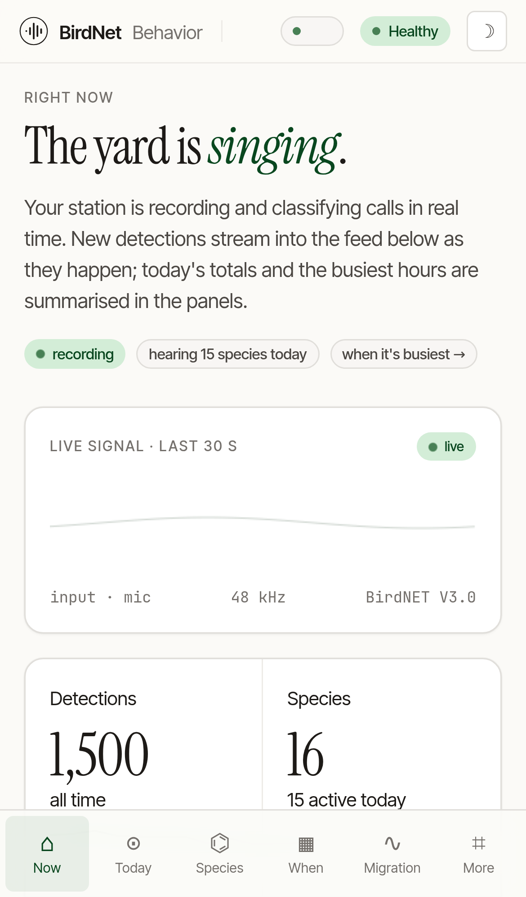
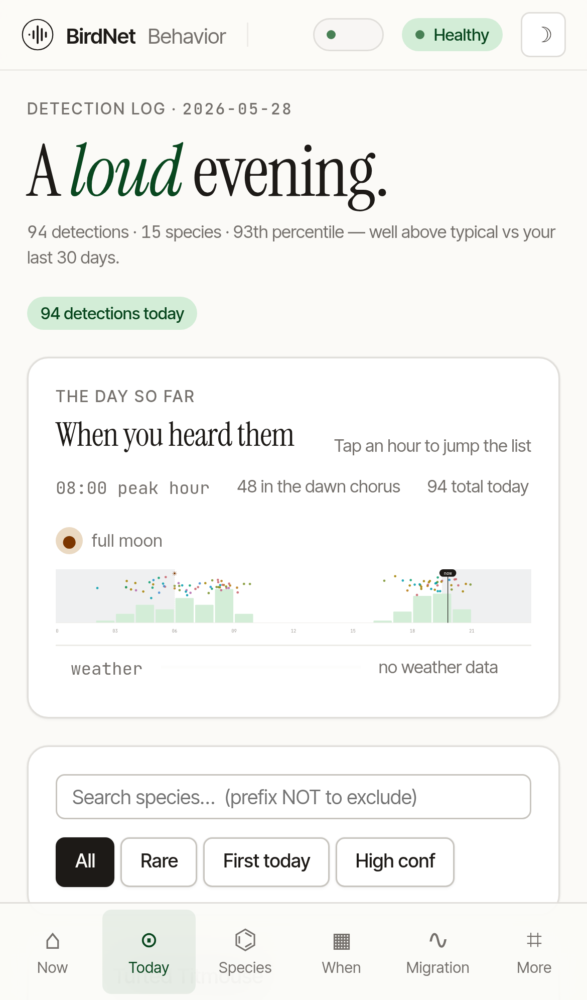

<h1 align="center">BirdNet-Behavior</h1>
<p align="center">Real-time acoustic bird classification with behavioral analytics — written in Rust, runs on a Raspberry Pi.</p>

<p align="center">
  <a href="https://github.com/tomtom215/BirdNet-Behavior/actions/workflows/ci.yml"></a>
  <a href="https://github.com/tomtom215/BirdNet-Behavior/actions/workflows/coverage.yml"></a>
  <a href="https://github.com/tomtom215/BirdNet-Behavior/actions/workflows/supply-chain.yml"></a>
</p>
<p align="center">
  <a href="https://creativecommons.org/licenses/by-nc-sa/4.0/"></a>
  
  
  
  
  
  
</p>

<p align="center">
  <strong>📖 <a href="https://tomtom215.github.io/BirdNet-Behavior/">Read the documentation</a></strong>
  &nbsp;·&nbsp; <a href="https://tomtom215.github.io/BirdNet-Behavior/getting-started/installation.html">Install</a>
  &nbsp;·&nbsp; <a href="https://tomtom215.github.io/BirdNet-Behavior/getting-started/docker.html">Docker</a>
  &nbsp;·&nbsp; <a href="https://tomtom215.github.io/BirdNet-Behavior/guide/today.html">Field Guide</a>
  &nbsp;·&nbsp; <a href="https://tomtom215.github.io/BirdNet-Behavior/guides/troubleshooting.html">Troubleshooting</a>
</p>

> [!IMPORTANT]
> BirdNet-Behavior is licensed **CC BY-NC-SA 4.0** — the same terms as the upstream BirdNET model and BirdNET-Pi.
> **You may not use this project to build a commercial product.** See [LICENSE](LICENSE) for details.

<p align="center">
  
</p>

---

## What is BirdNet-Behavior?

A ground-up Rust rewrite of [BirdNET-Pi](https://github.com/mcguirepr89/BirdNET-Pi). It listens to a USB microphone or RTSP stream, identifies birds in real time with the BirdNET+ V3.0 neural network, and serves a fast, responsive web dashboard you open in any browser.

It ships as **one self-contained binary** (~75 MB). The ONNX Runtime inference engine and the DuckDB analytics engine are compiled in — there is no Python, no `pip`, no virtualenv, and nothing else to install. The binary links against the host's system C library, so it targets modern 64-bit Linux (**glibc ≥ 2.39** — Raspberry Pi OS Trixie, Debian 13, Ubuntu 24.04); a Docker image carries its own runtime for everything older. Upgrading is replacing one file.

> **It is a clean rewrite, not a fork.** See [Credits & Attribution](#credits--attribution).

### How it compares to BirdNET-Pi

|  | BirdNET-Pi (Python) | BirdNet-Behavior (Rust) |
|---|---|---|
| Runtime | CPython interpreter + virtualenv | One native binary — no interpreter |
| Install | `pip` into a venv + system packages | one file, or one `curl` installer |
| Upgrade | re-resolve pip dependencies | replace one file |
| Inference | TensorFlow Lite (Python) | ONNX Runtime, linked in-process |
| Analytics | — | DuckDB behavioral engine, built in |
| Each release ships | — | signed SLSA provenance + CycloneDX SBOM |

Every BirdNET build is dominated by the model itself — the BirdNET+ weights cost the same memory whichever runtime loads them. What Rust removes is the overhead *around* the model: no interpreter to warm up, no virtualenv, no GIL serializing the request path. Audio capture and the detection loop run on a dedicated thread; the web server answers requests concurrently on a single Tokio runtime. It runs comfortably on a 2 GB Raspberry Pi.

---

## Screenshots

Every screen leads with a plain-English headline, then layers the dense numbers beneath — designed to serve a casual hobbyist and a PhD ornithologist at once. Light + dark themes, fully responsive.

<table>
  <tr>
    <td width="50%"><a href="https://tomtom215.github.io/BirdNet-Behavior/guide/today.html"></a><br><sub><b>Today</b> — live signal, day strip + unified detection log</sub></td>
    <td width="50%"><a href="https://tomtom215.github.io/BirdNet-Behavior/guide/patterns.html"></a><br><sub><b>Patterns</b> — heatmap, circadian polar, ridgeline, trends</sub></td>
  </tr>
  <tr>
    <td><a href="https://tomtom215.github.io/BirdNet-Behavior/guide/patterns.html"></a><br><sub><b>Co-occurrence</b> — matrix + acoustic-network chord diagram</sub></td>
    <td><a href="https://tomtom215.github.io/BirdNet-Behavior/guide/species.html"></a><br><sub><b>Life List</b> — birding journal with a growth curve</sub></td>
  </tr>
  <tr>
    <td><a href="https://tomtom215.github.io/BirdNet-Behavior/guide/reports.html"></a><br><sub><b>Reports</b> — weekly recap, year in review, history</sub></td>
    <td><a href="https://tomtom215.github.io/BirdNet-Behavior/guide/species.html"></a><br><sub><b>Gallery</b> — the Species → Photos view</sub></td>
  </tr>
  <tr>
    <td><a href="https://tomtom215.github.io/BirdNet-Behavior/admin/audio.html"></a><br><sub><b>Audio setup</b> — USB + RTSP mic management</sub></td>
    <td><a href="https://tomtom215.github.io/BirdNet-Behavior/guide/today.html"></a><br><sub><b>Dark mode</b> — a cool observatory theme</sub></td>
  </tr>
</table>

### On the phone

The same design system, with all six homes on a bottom tab-bar — iPhone 13 captures.

<table>
  <tr>
    <td width="50%"><br><sub><b>Today</b> — bottom tab-bar, live signal, top species</sub></td>
    <td width="50%"><br><sub><b>Detection log</b> — searchable, hourly day strip, swipe-friendly</sub></td>
  </tr>
</table>

➡️ **See every screen in the [Field Guide](https://tomtom215.github.io/BirdNet-Behavior/guide/today.html)** — every PNG above has a matching `docs/book/images/mobile/` capture for the same data and chrome at iPhone 13 width.

---

## Quick start

**On a Raspberry Pi (OS Trixie) or modern x86_64 Linux, install the native binary — it's the shortest path: one command, nothing else to set up.** It downloads and sha256-verifies the binary *and* the model (both from GitHub), auto-detects your USB mic, asks for your location, and starts a hardened systemd service:

```bash
curl -fsSL https://raw.githubusercontent.com/tomtom215/BirdNet-Behavior/main/install.sh | sudo bash
```

> Run it exactly as shown — pipe into `sudo bash`, **not** `sudo bash <(curl …)` (the process-substitution form breaks under `sudo`). On a fresh 64-bit Raspberry Pi OS **Trixie** image the prebuilt binary runs as-is (glibc 2.39); the installer refuses early, with guidance, on anything older.

**Prefer Docker?** Use it if you're on **older Pi OS (Bookworm, glibc 2.36)** — the native binary won't run there — or you just want a container; it bundles its own runtime, so the host OS version doesn't matter. Raspberry Pi OS doesn't ship Docker, so install [Docker Engine](https://docs.docker.com/engine/install/) first (`curl -fsSL https://get.docker.com | sudo sh`), then run the one-liner below. It auto-detects your USB mic, asks for your location, writes a minimal `.env`, and starts the container:

```bash
bash <(curl -fsSL https://raw.githubusercontent.com/tomtom215/BirdNet-Behavior/main/quickstart.sh)
```

**macOS (Apple Silicon)** — the same installer detects macOS and sets up a per-user launchd LaunchAgent instead of systemd (**no `sudo`**):

```bash
curl -fsSL https://raw.githubusercontent.com/tomtom215/BirdNet-Behavior/main/install.sh | bash
```

> On macOS it installs the `aarch64-apple-darwin` build once a release publishes one; until then it offers to `brew install` the dependencies and prints the one-time source-build steps. A Homebrew formula is planned. (See [docs/MACOS.md](docs/MACOS.md).)

The BirdNET+ V3.0 model (~541 MB) downloads automatically on first run — sha256-verified, from the same GitHub release line as the binary, so the install needs a single network origin and is offline-capable afterwards (it falls back to Zenodo, the upstream source, if the GitHub asset is unavailable). When it's ready, open **<http://localhost:8502>** — or, from another device on your LAN, `http://<hostname>.local:8502` (or `http://<pi-ip>:8502` by IP; the installer prints both, and the dashboard binds to all interfaces by default). Viewing is open; only the `/admin` panel needs a login. The bare-metal installer auto-generates that admin password (sign in as `admin`) and prints it once in its summary — save it. To restrict the dashboard to the machine itself, set `BIRDNET_LISTEN=127.0.0.1:8502`.

**Uninstall** (ships beside the binary, and as a release asset). It removes only the software by default — your database, recordings, and settings are kept unless you opt in:

```bash
sudo ./uninstall.sh              # remove the service + binary, KEEP all data
sudo ./uninstall.sh --dry-run    # preview exactly what would change
sudo ./uninstall.sh --purge      # remove everything, including data + model
```

📖 Full instructions: [Installation](https://tomtom215.github.io/BirdNet-Behavior/getting-started/installation.html) · [Docker guide](https://tomtom215.github.io/BirdNet-Behavior/getting-started/docker.html) · [Configuration](https://tomtom215.github.io/BirdNet-Behavior/getting-started/configuration.html)

---

## Supported hardware & OS

| Platform | Status | Notes |
|---|---|---|
| **Raspberry Pi 5 / 4B / 400** (64-bit) | ✅ Recommended | 64-bit Raspberry Pi OS **Trixie** |
| **x86_64 Linux** | ✅ Supported | glibc ≥ 2.39 (Debian 13 / Ubuntu 24.04+) |
| **Pi OS Bookworm** (glibc 2.36) | ⚠️ Docker only | Native binary needs glibc ≥ 2.39 — use Docker (bundles its own runtime) or upgrade to Trixie |
| **Pi 3 / Zero 2 W on 32-bit OS** (armv7) | ❌ | No prebuilt ONNX Runtime — reflash with 64-bit Pi OS |

**Runtime requirement: glibc ≥ 2.39** (Pi OS Trixie / Debian 13 / Ubuntu 24.04). The prebuilt binaries are built on Ubuntu 24.04 to match pyke's ONNX Runtime baseline; `install.sh` refuses to install on an older glibc and points you to Docker. Every prebuilt binary and the Docker image ship the DuckDB behavioral-analytics engine **built in and on by default** — the installer and Docker compose set the analytics database path automatically (for a manual binary run, pass `--analytics-db`; from source it is on by default, or build `--no-default-features` to omit it).

---

## Features

**Everything BirdNET-Pi does** — real-time detection from a USB mic or RTSP stream, the BirdNET+ V3.0 model, a SQLite detection database, per-species pages, Apprise notifications (Telegram, Slack, Discord, and dozens more), BirdWeather uploads, email alerts, CSV/JSON/eBird export, web-based admin, database backup/restore, and HTTP basic auth — **plus** the multi-source capture (USB + PipeWire + many RTSP at once), per-stream supervision, and offline-resilient uploads covered in [Built for the field](#built-for-the-field--and-for-research) below.

**New in BirdNet-Behavior:**

- **A redesigned UI** — two-dozen-plus screens, OKLCH light/dark themes, self-hosted fonts, bespoke SVG visualizations (streamgraph, circadian polar, co-occurrence chord diagram, migration ridgeline, DayStrip), fully responsive down to a phone.
- **Behavioral analytics** (built into every release, on by default; `--no-default-features` to omit) — activity sessions, resident vs. migrant classification, dawn-chorus validation, species co-occurrence, migration phenology.
- **IoT / Home Automation** — pure-Rust MQTT 3.1.1 publishing with Home Assistant auto-discovery.
- **Editorial reports** — a Weekly Report and a celebratory Year in Review.
- **Share & follow** — a per-detection [detail page](https://tomtom215.github.io/BirdNet-Behavior/guide/sharing.html) with spectrogram + audio, signed public **share links** (`/r/<token>`, HMAC-SHA256, 30-day expiry), and **RSS/iCal feeds** for rare and daily detections. Print stylesheet for the reports.
- **Per-device display preferences** — theme, density, motion and contrast, applied before first paint (no flash on reload).
- **Operational polish** — rare-bird quarantine queue, audio quality pre-filtering, a built-in `--doctor` diagnostic, Prometheus metrics, kiosk mode, a live spectrogram, and a first-run onboarding wizard.

➡️ Tour them all in the [Field Guide](https://tomtom215.github.io/BirdNet-Behavior/guide/today.html). New environment variables for these features — `BNB_SHARE_SECRET`, `BNB_BASE_URL`, `BNB_STATION_LAT`/`BNB_STATION_LON` — are documented in [`.env.example`](.env.example) and the [configuration reference](https://tomtom215.github.io/BirdNet-Behavior/reference/configuration-reference.html).

---

## Built for the field — and for research

A station is only useful if it keeps running when nobody is watching, and the data is only useful if you can trust it. Both the casual hobbyist who checks the dashboard over coffee and the researcher whose dataset underpins a conservation case get the same guarantees:

- **Multi-source capture, supervised independently.** Run one or more USB/ALSA mics, a PipeWire source, and any number of RTSP streams *at once*. Each source has its own subprocess, its own recordings, and its own health gauge; a camera that reboots or a mic that's unplugged is restarted with capped exponential backoff (2 s → 60 s, then forever) **without disturbing the others or pausing detection**. A source that stays alive but goes *silent* — a wedged RTSP session, a mic hung after a USB re-enumeration — is detected by watching its segment output and restarted too, the failure mode a liveness check alone can't see.
- **No data lost to a flaky uplink.** BirdWeather uploads that fail during an outage are parked in the local database and replayed **in order** when the network returns — bounded so a months-long outage can't fill the disk. The detection pipeline never blocks on the network: a dead broker or an offline link slows nothing down, and the local database is always ground truth.
- **It tells you when it's unhappy.** A detection **deadman** measures how long since the last detection end-to-end (the one signal that proves the whole audio → inference → database chain is alive — every component can look healthy while a clogged mic foam records silence) and, past a configurable threshold, logs loudly and sends a single notification, with a recovery notice when birds return. Exposed as the `birdnet_detection_silence_seconds` Prometheus gauge, on `/api/v2/health`, and as a plain-English "Last Detection" row on the System page.
- **Data sovereignty for sensitive species.** Point uploads at a **self-hosted ingest** (`BIRDWEATHER_URL`) instead of the public community map — for rare or endangered species where a public observation map is a poaching risk — and the offline queue and ordered replay come with it.
- **Survives power loss and a wrong clock.** WAL journalling, scheduled integrity checks, rolling backups, and corruption-quarantine-then-recover at boot keep the database intact across yanked power. With no RTC, capture *fails open* until NTP syncs so a bogus boot-time clock never silences the station. systemd watchdog supervision restarts a hung process and gives up cleanly (never a restart loop) on a permanently broken one.

📖 The complete playbook — hardware, power, storage, monitoring, recovery — is the [**Field Deployment Runbook**](docs/FIELD_DEPLOYMENT.md) — also published in the [operator manual](https://tomtom215.github.io/BirdNet-Behavior/field/deployment.html).

---

## Engineering

The project is built to be read as well as run:

- **Language** — Rust 2024, **MSRV 1.95**, enforced by a dedicated CI job so a newer-toolchain feature can't slip in unnoticed.
- **Safety** — `unsafe` code is **forbidden** across the entire workspace (`unsafe_code = "forbid"` — not merely denied, so a stray `#[allow]` can't reintroduce it). Public API is documented under `missing_docs`.
- **Lints** — Clippy `pedantic` + `nursery` + `cargo`, and CI fails on any warning (`-D warnings`). `rustfmt` is checked, not just suggested.
- **Errors** — library crates use hand-rolled error types; no `anyhow`/`thiserror` reaching for a `Box<dyn Error>`.
- **Runtime discipline** — the compute and storage crates (`birdnet-core`, `birdnet-db`) are deliberately *synchronous* and own no async runtime. The application layer owns the single Tokio runtime and pushes blocking work — inference, SQLite, DuckDB, file I/O — onto `spawn_blocking`. The detection loop hands finished detections to the async layer over a **bounded** channel, and every network integration is dispatched *off* that path, so a slow consumer or a dead uplink applies backpressure or queues instead of stalling detection or leaking memory.
- **Tests** — 1,690+ across the workspace: unit, integration, property-based (`proptest`), a soak test asserting bounded memory / file-descriptor / database growth, end-to-end tests that boot the **real compiled binary** as a subprocess (clean startup *and* shutdown, store-and-forward replay against a stub upload server), and `cargo-fuzz` harnesses for the untrusted-input parsers (audio decode, label parsing). Test policy bans fixed-sleep synchronization — readiness is signalled or polled.
- **Supply chain** — every GitHub Actions step is pinned to a full commit SHA; `cargo-deny` gates advisories, licenses, and sources. Every release publishes cross-compiled binaries (aarch64 + x86_64) carrying a signed **SLSA build-provenance** attestation and a **CycloneDX 1.5 SBOM**; the model is fetched from a single origin, sha256-verified, and the install runs fully offline afterward.
- **Provenance** — `CITATION.cff` for academic citation, `GOVERNANCE.md` for the decision model, and a `CHANGELOG.md` kept in Keep-a-Changelog form.

---

## Architecture

A single binary built from eight Rust workspace crates:

| Crate | Responsibility |
|---|---|
| `birdnet-core` | Audio capture, decode, resample, mel spectrogram, ONNX inference, the detection pipeline, live spectrogram |
| `birdnet-db` | SQLite (OLTP) + DuckDB (OLAP), migrations, resilience |
| `birdnet-web` | axum web server, REST API, WebSocket, HTMX templates, audio player, admin |
| `birdnet-integrations` | BirdWeather, Apprise, MQTT (Home Assistant discovery), Wikipedia images, email, heartbeat, weekly reports, auto-update |
| `birdnet-behavioral` | DuckDB behavioral analytics (sessionization, retention, funnel, sequence matching) |
| `birdnet-timeseries` | Time-series analytics (activity, diversity, trend, peak, gap, sessions) |
| `birdnet-migrate` | BirdNET-Pi migration: schema detection, validation, import |
| `birdnet-scheduler` | Solar calculations, recording-window scheduling |

📖 [Architecture overview](https://tomtom215.github.io/BirdNet-Behavior/reference/architecture.html) · full design docs in [`docs/architecture/`](docs/architecture/).

---

## Migrating from BirdNET-Pi

Safe, non-destructive import — the source database is opened read-only and never modified. Stop BirdNET-Pi, open `/admin/migrate`, point it at your `BirdDB.txt`, review the preview, and import. Duplicate rows are skipped, so re-running is safe.

📖 [Migration guide](https://tomtom215.github.io/BirdNet-Behavior/guides/migration.html)

---

## Building from source

**Prerequisites:** [Rust 1.95+](https://rustup.rs) and `git`. The first build also compiles the bundled DuckDB (a few minutes of C++), so `cmake` and a C++ compiler must be on `PATH`.

```bash
git clone https://github.com/tomtom215/BirdNet-Behavior.git
cd BirdNet-Behavior

cargo build --release                       # optimized build — analytics on by default
cargo build --release --no-default-features # slim build, without the DuckDB analytics engine
cross build --release --target aarch64-unknown-linux-gnu   # cross-compile for a Pi

cargo test --workspace --all-features                    # run tests
cargo clippy --workspace --all-targets --all-features -- -D warnings   # lint (pedantic + nursery)
```

---

## Troubleshooting

First step for any problem — run the built-in diagnostic, which prints a one-screen report (CPU, config, audio reachability, model, database, disk, network) with a concrete fix for each issue:

```bash
sudo -u birdnet birdnet-behavior --doctor            # bare metal
docker compose exec birdnet birdnet-behavior --doctor   # Docker
```

📖 [Troubleshooting guide](https://tomtom215.github.io/BirdNet-Behavior/guides/troubleshooting.html) · deeper recipes in [`TROUBLESHOOTING.md`](TROUBLESHOOTING.md).

---

## Documentation

The complete, navigable documentation lives at **[tomtom215.github.io/BirdNet-Behavior](https://tomtom215.github.io/BirdNet-Behavior/)** — installation, a screen-by-screen field guide, configuration, administration, migration, an FAQ, and troubleshooting. It is built with [mdBook](https://rust-lang.github.io/mdBook/) from the Markdown in [`docs/book/`](docs/book/) and published automatically on every push to `main`. The same rendered manual ships inside each release tarball and is served offline at `/help`.

---

## Credits & Attribution

- **[BirdNET](https://github.com/kahst/BirdNET-Analyzer)** — ML model by the K. Lisa Yang Center for Conservation Bioacoustics, Cornell Lab of Ornithology
- **[BirdNET-Pi](https://github.com/mcguirepr89/BirdNET-Pi)** — original Pi implementation by [Patrick McGuire](https://github.com/mcguirepr89)
- **[BirdNET-Pi fork](https://github.com/Nachtzuster/BirdNET-Pi)** — maintained fork by [Nachtzuster](https://github.com/Nachtzuster)
- **[duckdb-behavioral](https://github.com/tomtom215/duckdb-behavioral)** — behavioral analytics by [tomtom215](https://github.com/tomtom215)

---

## License

Licensed under [CC BY-NC-SA 4.0](https://creativecommons.org/licenses/by-nc-sa/4.0/), matching the upstream BirdNET and BirdNET-Pi projects. See [LICENSE](LICENSE) and [LICENSE-UPSTREAM](LICENSE-UPSTREAM) for full terms.

---

## Related Projects

| Repository | Description |
|---|---|
| [duckdb-behavioral](https://github.com/tomtom215/duckdb-behavioral) | ClickHouse-inspired behavioral analytics for DuckDB |
| [quack-rs](https://github.com/tomtom215/quack-rs) | SDK for building DuckDB extensions in Rust |
| [mallardmetrics](https://github.com/tomtom215/mallardmetrics) | Single-binary web analytics (axum + DuckDB) |
| [LyreBirdAudio](https://github.com/tomtom215/LyreBirdAudio) | RTSP audio streaming |
