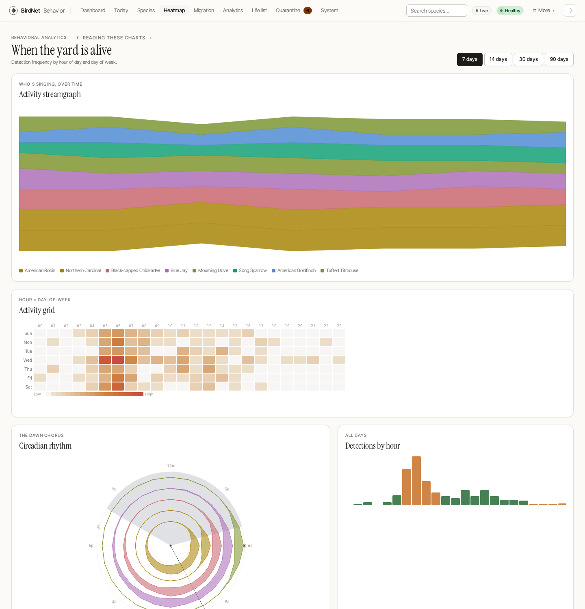
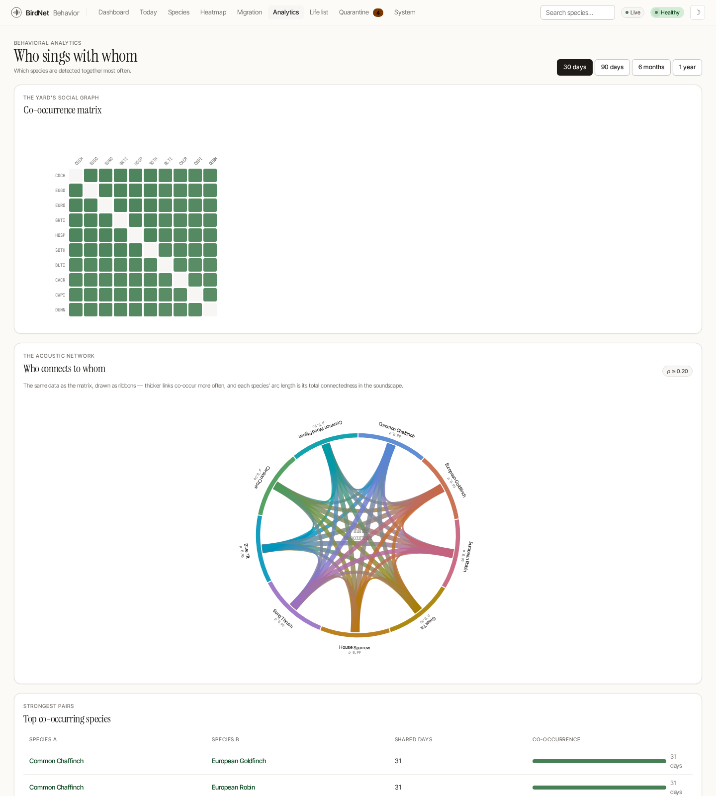
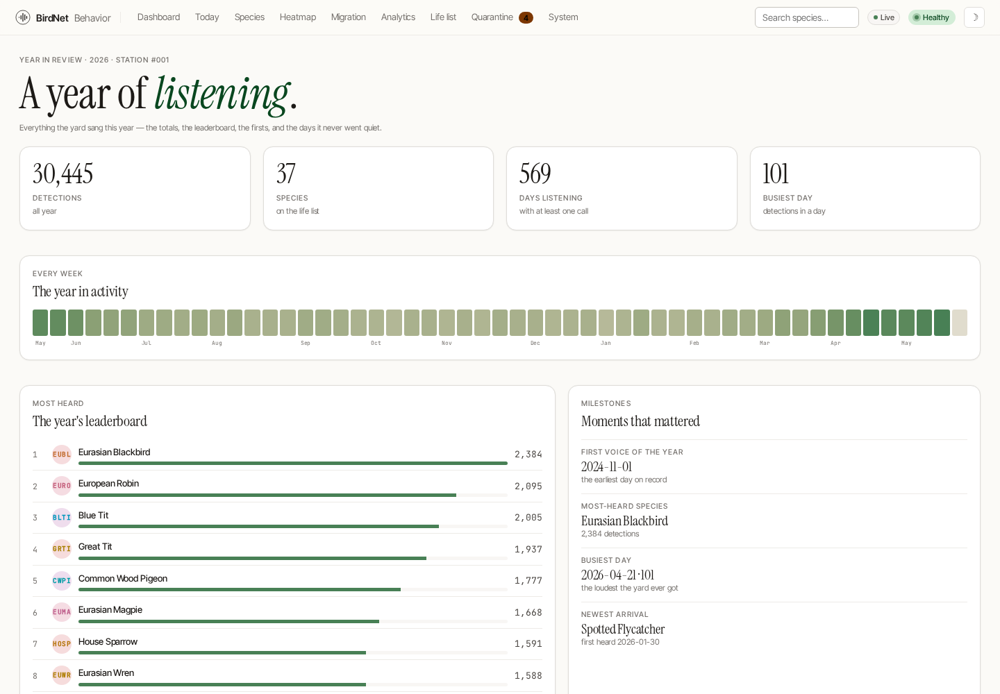

<h1 align="center">BirdNet-Behavior</h1>
<p align="center">Real-time acoustic bird classification with behavioral analytics — written in Rust, runs on a Raspberry Pi.</p>

<p align="center">
  <a href="https://creativecommons.org/licenses/by-nc-sa/4.0/"></a>
  
  
  
  
</p>

<p align="center">
  <strong>📖 <a href="https://tomtom215.github.io/BirdNet-Behavior/">Read the documentation</a></strong>
  &nbsp;·&nbsp; <a href="https://tomtom215.github.io/BirdNet-Behavior/getting-started/installation.html">Install</a>
  &nbsp;·&nbsp; <a href="https://tomtom215.github.io/BirdNet-Behavior/getting-started/docker.html">Docker</a>
  &nbsp;·&nbsp; <a href="https://tomtom215.github.io/BirdNet-Behavior/guide/dashboard.html">Field Guide</a>
  &nbsp;·&nbsp; <a href="https://tomtom215.github.io/BirdNet-Behavior/guides/troubleshooting.html">Troubleshooting</a>
</p>

> [!IMPORTANT]
> BirdNet-Behavior is licensed **CC BY-NC-SA 4.0** — the same terms as the upstream BirdNET model and BirdNET-Pi.
> **You may not use this project to build a commercial product.** See [LICENSE](LICENSE) for details.

<p align="center">
  
</p>

---

## What is BirdNet-Behavior?

A ground-up Rust rewrite of [BirdNET-Pi](https://github.com/mcguirepr89/BirdNET-Pi). It runs on a Raspberry Pi, listens to your microphone or RTSP camera, identifies birds in real time using the BirdNET+ neural network, and serves a fast, beautiful web dashboard you open in any browser.

It ships as a **single static binary** — no Python, no pip, no virtualenv. Drop it on a Pi and run it.

| | BirdNET-Pi (Python) | BirdNet-Behavior (Rust) |
|---|---|---|
| Memory | 400–600 MB | ~20–50 MB |
| Cold start | 5–15 s | < 1 s |
| Dependencies | pip + venv + system libs | None — one binary |
| Upgrade | pip breakage, virtualenv rot | copy one file |
| Concurrency | GIL-constrained | Lock-free parallel audio |

> **It is a clean rewrite, not a fork.** See [Credits & Attribution](#credits--attribution).

---

## Screenshots

Every screen leads with a plain-English headline, then layers the dense numbers beneath — designed to serve a casual hobbyist and a PhD ornithologist at once. Light + dark themes, fully responsive.

<table>
  <tr>
    <td width="50%"><a href="https://tomtom215.github.io/BirdNet-Behavior/guide/today.html"></a><br><sub><b>Today</b> — searchable log + 24-hour DayStrip</sub></td>
    <td width="50%"><a href="https://tomtom215.github.io/BirdNet-Behavior/guide/analytics.html"></a><br><sub><b>Analytics</b> — streamgraph, mosaic, circadian polar, ridgeline</sub></td>
  </tr>
  <tr>
    <td><a href="https://tomtom215.github.io/BirdNet-Behavior/guide/analytics.html"></a><br><sub><b>Co-occurrence</b> — matrix + acoustic-network chord diagram</sub></td>
    <td><a href="https://tomtom215.github.io/BirdNet-Behavior/guide/species.html"></a><br><sub><b>Life List</b> — birding journal with a growth curve</sub></td>
  </tr>
  <tr>
    <td><a href="https://tomtom215.github.io/BirdNet-Behavior/guide/reports.html"></a><br><sub><b>Year in Review</b> — editorial annual recap</sub></td>
    <td><a href="https://tomtom215.github.io/BirdNet-Behavior/guide/recordings.html"></a><br><sub><b>Gallery</b> — species photo grid</sub></td>
  </tr>
  <tr>
    <td><a href="https://tomtom215.github.io/BirdNet-Behavior/admin/audio.html"></a><br><sub><b>Audio setup</b> — USB + RTSP mic management</sub></td>
    <td><a href="https://tomtom215.github.io/BirdNet-Behavior/guide/dashboard.html"></a><br><sub><b>Dark mode</b> — a cool observatory theme</sub></td>
  </tr>
</table>

➡️ **See every screen in the [Field Guide](https://tomtom215.github.io/BirdNet-Behavior/guide/dashboard.html).**

---

## Quick start

**The fastest path is Docker.** One command — it auto-detects your USB mic, asks for your location, writes a minimal `.env`, and starts the container:

```bash
bash <(curl -fsSL https://raw.githubusercontent.com/tomtom215/BirdNet-Behavior/main/quickstart.sh)
```

**Bare metal (Raspberry Pi, no Docker):**

```bash
curl -fsSL https://raw.githubusercontent.com/tomtom215/BirdNet-Behavior/main/install.sh | sudo bash
```

The BirdNET+ V3.0 model (~541 MB) downloads automatically from Zenodo on first run. When it's ready, open **<http://localhost:8502>**.

📖 Full instructions: [Installation](https://tomtom215.github.io/BirdNet-Behavior/getting-started/installation.html) · [Docker guide](https://tomtom215.github.io/BirdNet-Behavior/getting-started/docker.html) · [Configuration](https://tomtom215.github.io/BirdNet-Behavior/getting-started/configuration.html)

---

## Features

**Everything BirdNET-Pi does** — real-time detection from a USB mic or RTSP stream, the BirdNET+ V3.0 model, a SQLite detection database, per-species pages, Apprise notifications (Telegram/Slack/Discord + 80 more), BirdWeather uploads, email alerts, CSV/JSON export, web-based admin, database backup/restore, and HTTP basic auth.

**New in BirdNet-Behavior:**

- **A redesigned UI** — 20+ pages, OKLCH light/dark themes, self-hosted fonts, bespoke SVG visualizations (streamgraph, circadian polar, co-occurrence chord diagram, migration ridgeline, DayStrip), fully responsive down to a phone.
- **Behavioral analytics** (optional `--features analytics`) — activity sessions, resident vs. migrant classification, dawn-chorus validation, species co-occurrence, migration phenology.
- **IoT / Home Automation** — pure-Rust MQTT 3.1.1 publishing with Home Assistant auto-discovery.
- **Editorial reports** — Weekly Report and a celebratory Year in Review.
- **Operational polish** — rare-bird quarantine queue, audio quality pre-filtering, a built-in `--doctor` diagnostic, Prometheus metrics, kiosk mode, a live spectrogram, and a first-run onboarding wizard.

➡️ Tour them all in the [Field Guide](https://tomtom215.github.io/BirdNet-Behavior/guide/dashboard.html).

---

## Migrating from BirdNET-Pi

Safe, non-destructive import — the source database is opened read-only and never modified. Stop BirdNET-Pi, open `/admin/migrate`, point it at your `BirdDB.txt`, review the preview, and import. Duplicate rows are skipped, so re-running is safe.

📖 [Migration guide](https://tomtom215.github.io/BirdNet-Behavior/guides/migration.html)

---

## Building from source

**Prerequisites:** [Rust 1.95+](https://rustup.rs) and `git`.

```bash
git clone https://github.com/tomtom215/BirdNet-Behavior.git
cd BirdNet-Behavior

cargo build --release                              # optimized build
cargo build --release --features analytics         # + DuckDB analytics
cross build --release --target aarch64-unknown-linux-gnu   # cross-compile for a Pi

cargo test --workspace                             # run tests
cargo clippy --workspace --all-targets -- -D warnings   # lint (pedantic + nursery)
```

---

## Troubleshooting

First step for any problem — run the built-in diagnostic, which prints a one-screen report (CPU, config, audio reachability, model, database, disk, network) with a concrete fix for each issue:

```bash
sudo -u birdnet birdnet-behavior --doctor            # bare metal
docker compose exec birdnet birdnet-behavior --doctor   # Docker
```

📖 [Troubleshooting guide](https://tomtom215.github.io/BirdNet-Behavior/guides/troubleshooting.html) · deeper recipes in [`TROUBLESHOOTING.md`](TROUBLESHOOTING.md).

---

## Architecture

A single binary built from eight Rust workspace crates — `birdnet-core` (audio + ML), `birdnet-db` (SQLite + DuckDB), `birdnet-web` (axum + HTMX), `birdnet-integrations`, `birdnet-behavioral`, `birdnet-timeseries`, `birdnet-migrate`, and `birdnet-scheduler`.

📖 [Architecture overview](https://tomtom215.github.io/BirdNet-Behavior/reference/architecture.html) · full design docs in [`docs/architecture/`](docs/architecture/).

---

## Documentation

The complete, navigable documentation lives at **[tomtom215.github.io/BirdNet-Behavior](https://tomtom215.github.io/BirdNet-Behavior/)** — installation, a screen-by-screen field guide, configuration, administration, migration, an FAQ, and troubleshooting. It is built with [mdBook](https://rust-lang.github.io/mdBook/) from the Markdown in [`docs/book/`](docs/book/) and published automatically on every push to `main`.

---

## Credits & Attribution

- **[BirdNET](https://github.com/kahst/BirdNET-Analyzer)** — ML model by the K. Lisa Yang Center for Conservation Bioacoustics, Cornell Lab of Ornithology
- **[BirdNET-Pi](https://github.com/mcguirepr89/BirdNET-Pi)** — original Pi implementation by [Patrick McGuire](https://github.com/mcguirepr89)
- **[BirdNET-Pi fork](https://github.com/Nachtzuster/BirdNET-Pi)** — maintained fork by [Nachtzuster](https://github.com/Nachtzuster)
- **[duckdb-behavioral](https://github.com/tomtom215/duckdb-behavioral)** — behavioral analytics by [tomtom215](https://github.com/tomtom215)

---

## License

Licensed under [CC BY-NC-SA 4.0](https://creativecommons.org/licenses/by-nc-sa/4.0/), matching the upstream BirdNET and BirdNET-Pi projects. See [LICENSE](LICENSE) and [LICENSE-UPSTREAM](LICENSE-UPSTREAM) for full terms.

---

## Related Projects

| Repository | Description |
|---|---|
| [duckdb-behavioral](https://github.com/tomtom215/duckdb-behavioral) | ClickHouse-inspired behavioral analytics for DuckDB |
| [quack-rs](https://github.com/tomtom215/quack-rs) | SDK for building DuckDB extensions in Rust |
| [mallardmetrics](https://github.com/tomtom215/mallardmetrics) | Single-binary web analytics (axum + DuckDB) |
| [LyreBirdAudio](https://github.com/tomtom215/LyreBirdAudio) | RTSP audio streaming |
