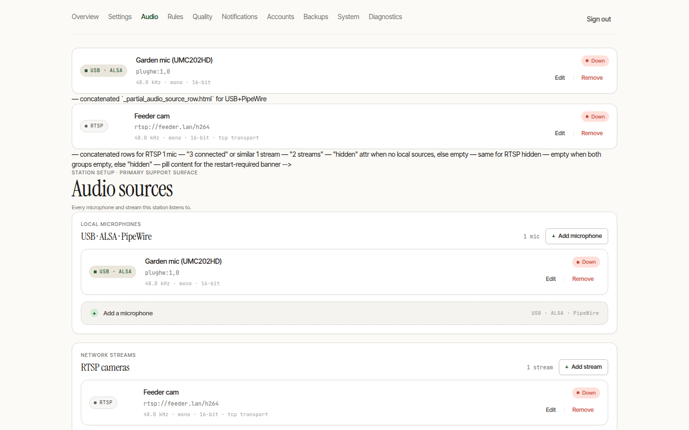

# Audio & Microphones

Microphone setup is the single most common support topic, so it gets its own page (`/admin/audio`) designed to be bulletproof.



## Your sources at a glance

Every input the station listens on appears in the source list — USB sound cards and RTSP cameras alike. Each row shows a live level meter with SNR, uptime, the last detection, and a 24-hour count, so you can tell at a glance whether a mic is healthy.

You can run **several sources at once** — one or more USB/ALSA mics, a PipeWire source, and any number of RTSP streams, in any combination (this is the headline gap in the original BirdNET-Pi). Each source captures into its own subprocess, tags its recordings with its own stream label, and gets its own health gauge, so detections stay attributable to the source that heard them.

## Independent supervision (built for the field)

Every source is supervised on its own, which is what makes a multi-camera station survivable when nobody is on site:

- **One source failing never disturbs the others.** A dead capture process — a camera that rebooted, a mic that was unplugged, a network blip — is restarted on its own with capped exponential backoff (2 s → 4 s → … → 60 s, then every 60 s **forever**; a source down for an hour is still recording when it comes back on hour two). The other sources keep recording and detection never pauses.
- **Silent stalls are caught too.** A source whose process is still *alive* but has stopped delivering audio — a wedged RTSP session, a mic hung after a USB re-enumeration — is detected by watching its segment output: no fresh recording for several segment-durations and it is restarted exactly like a crash. A plain "is the process running?" check can't see this; it's the failure mode that quietly loses a whole night otherwise. (It fails open while the system clock is unsynced, so a wrong boot-time clock never triggers a false restart.)
- **You can see it.** The per-source `birdnet_audio_source_up{source="…"}` Prometheus gauge reflects real liveness, and a source that has been down a couple of minutes logs a loud, rate-limited warning to the journal.

## Tuning a source

Expand any source with **▸ tune** to open its control panel:

- **Input gain** (−12 → +24 dB) with a zero mark,
- **Sample rate** (8 / 16 / 22.05 / 44.1 / 48 kHz),
- **Channels** (mono / left / right / stereo),
- **Bit depth** (16 / 24-bit PCM),
- **RTSP transport** (auto / TCP / UDP) for camera sources — auto resolves to the NAT-robust TCP default; force UDP only for a camera that needs it,
- **Quiet window** — an optional per-source `HH:MM`–`HH:MM` pause (UTC), e.g. to silence a noisy road-facing mic during rush hour without touching the others,
- **Pipeline toggles** — high-pass filter, DC-offset removal, auto-gain control, RTSP keepalive.

> Per-source settings (device, gain, sample rate, transport, quiet window) are read when the capture subsystem starts, so **restart the service after changing them** for the change to take effect.

> Aim for peaks near −6 dB. Gain set too high clips the loudest calls and hurts identification more than a quiet signal does.

## Adding an RTSP camera

The **Add a source** wizard walks through three steps — URL (with a locked `rtsp://` prefix), optional auth, and a label — and shows a live reachability pill with the sniffed audio properties before you commit. A preview row lets you listen for ten seconds first.

> RTSP capture needs **`ffmpeg`** on the host. The bare-metal installer installs it automatically when your config has an `RTSP_URL` (re-run `sudo bash install.sh repair` if you add RTSP later), and the Docker image already bundles it. Without `ffmpeg`, RTSP sources record zero detections.

## Finding a USB mic

```bash
arecord -l
# card 1: PRO [Comica_Traxshot PRO], device 0: USB Audio [USB Audio]
#      ^ index                ^ id
arecord -D plughw:CARD=PRO,DEV=0 -d 3 /tmp/test.wav && aplay /tmp/test.wav
```

Set the device in `.env` (`BIRDNET_ALSA_DEVICE=…`) or via the CLI flag — see [Configuration](../getting-started/configuration.md).

## Name the card, don't number it

A card **index** (the `1` in `plughw:1,0`) is assigned in detection order and is
not stable. It changes when USB devices are re-enumerated, and a reboot is free
to do that.

This is not hypothetical. During an on-device acceptance run, the same
microphone on the same Raspberry Pi 4 was `card 1: PRO` before a cold reboot and
`card 3: PRO` afterwards. The station came back up, served a perfectly healthy
dashboard, and recorded nothing — the capture supervisor retried a device that
no longer existed, indefinitely. Nothing was broken except a number.

The **id** (`PRO` above) does not move. Address the card by it:

```dotenv
ALSA_CARD=plughw:CARD=PRO,DEV=0
```

`CARD` is a first-class ALSA argument, not a trick: alsa-lib's own `alsa.conf`
declares `pcm.plughw { @args [ CARD DEV SUBDEV ] }` with `@args.CARD { type
string }`. A fresh install now writes this form automatically when it can, and
falls back to the index only when the id would be ambiguous — two identical
microphones report the same id, and then only the index can tell them apart.

After editing the config, apply it with `sudo bash install.sh repair`.

### Pinning your own names (recommended for multi-mic stations)

The id comes from the device's own firmware, so two identical microphones give
you two cards called `PRO`. [`usb-audio-mapper`](https://github.com/tomtom215/usb-audio-mapper)
solves this properly: it writes a udev rule keyed on vendor/product **and USB
port path**, setting `ATTR{id}` to a name you choose.

```bash
sudo ./usb-audio-mapper.sh          # interactive; reboot when it asks
arecord -l                          # now shows your chosen name as the id
```

Then set `ALSA_CARD=plughw:CARD=<your-name>,DEV=0`. The name survives reboots,
re-plugging, and swapping identical devices between ports — which is the only
way to keep several microphones straight on one station.

`--doctor` validates either form and, if the configured card is missing, names
the card that *is* present and prints the exact line to set.

## Common pitfalls

- USB hubs can drop audio under load — prefer a direct port on the Pi.
- RTSP over UDP drops packets on busy Wi-Fi — leave the per-source **transport** on `auto` (TCP) for stability; only force `udp` for a camera that requires it.
