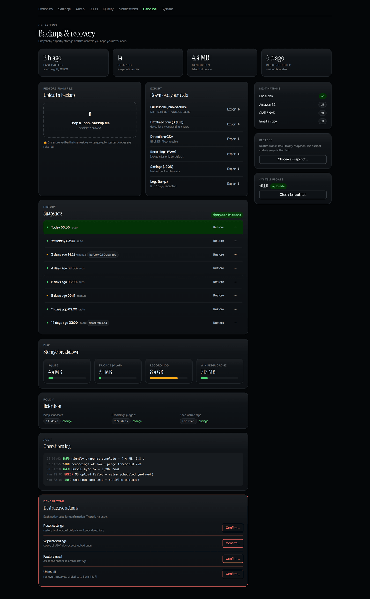

# Backups & Recovery

The **Backups** page (`/admin/backups`) is the full sysadmin surface — snapshots, exports, storage, and the controls you hope you never need.

## Snapshots

A nightly automatic backup runs on its own; you can also take a manual snapshot any time. The snapshot list shows when each was taken, whether it was automatic or manual, and tags pre-upgrade snapshots so you can roll back a bad update. **Restore** rolls the station back to any snapshot — and snapshots the current state first, so a restore is itself reversible.

## Import & export

- **Restore from file** — drop a `.bnb-backup` bundle; its signature is verified before anything is touched, so tampered or partial bundles are rejected.
- **Export** — download a full bundle, just the SQLite database, a BirdNET-Pi-compatible detections CSV, your locked recordings, the settings JSON, or recent logs.

## Storage & retention

A storage breakdown shows where space is going (SQLite, DuckDB, recordings, the Wikipedia image cache). Retention is **not time-based**: the disk manager purges the oldest recordings once the disk crosses the purge threshold (default 95%) and keeps at most `BIRDNET_MAX_FILES_PER_SPECIES` per species. Recordings you've **locked** are never purged.

## Danger zone

Destructive actions — reset settings, wipe recordings, factory reset, uninstall — live in a clearly marked danger zone, each gated behind an explicit confirmation. There is no undo, so take a snapshot first.
