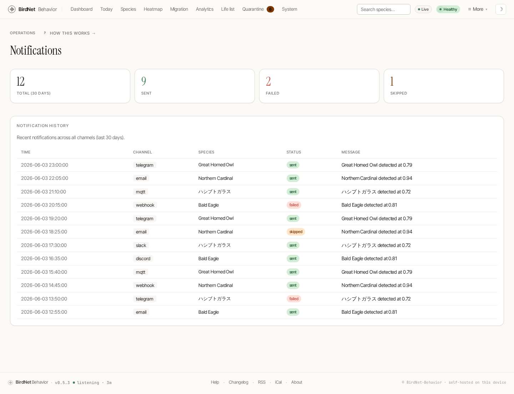

# Notifications & Integrations

BirdNet-Behavior can tell the rest of your world when a bird shows up — from a Telegram ping to a Home Assistant entity.

## Notification center

The **Notifications** page (`/notifications`) shows your channels and a log of recent events, with per-channel send counts, delivery status, and the last-sent time.



## Channels

- **Apprise** — one URL string unlocks 80+ services (Telegram, Slack, Discord, Pushover, ntfy, email, and more). Set it under Settings → Notifications, or with `BIRDNET_APPRISE_URL`.
- **Email** — direct SMTP/STARTTLS with a per-species cooldown, configured under Settings → Notifications.
- **BirdWeather** — upload detections to your BirdWeather station. Set the token under Settings → Notifications, or with `BIRDNET_BIRDWEATHER_TOKEN`.

Either surface works for all three: the environment variable wins if you set it,
otherwise the value you save under Settings → Notifications is the one that
sends. The same applies to the minimum notification confidence
(`BIRDNET_NOTIFY_CONFIDENCE`, default `0.8`), the trigger mode, the cooldown,
the species allow/exclude lists, and the message templates. Changes take effect
on the next restart.

The **Send test notification** button on `/admin` uses the values saved on the
Settings page, so a successful test means live detections will notify too.

## MQTT & Home Assistant

A pure-Rust MQTT 3.1.1 client publishes detections to any broker (Mosquitto, Node-RED, EMQX, …) — no external broker library required.

```text
BIRDNET_MQTT_HOST=192.168.1.10
BIRDNET_MQTT_HA_DISCOVERY=1     # publish Home Assistant auto-discovery config
```

With `--mqtt-ha-discovery`, the station registers itself in Home Assistant automatically, so the latest detection, species count and confidence appear as entities you can put on a dashboard or trigger automations from.

## Alert rules

The **Rules** engine (`/admin/rules`) fires conditional actions on detections — for example, a webhook only when an owl is heard at night above 0.7 confidence, or a rule that suppresses a noisy false-positive species. Each rule matches on species pattern, confidence range, hour-of-day and day-of-week.
