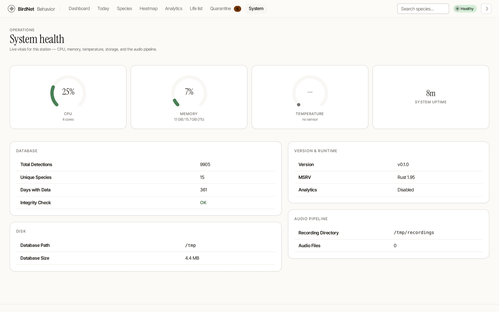

# Station Health

The Station **Health** tab (`/station`) is the station's vital-signs monitor — the operator's "is it working?" screen, and the public, login-free heir to the old `/system` page (which now permanently redirects here).



- **Status banner** — one line that stays green while nothing needs attention, and flips to amber naming the problem when storage runs low, the database integrity check fails, no audio sources are configured, or uploads are backed up.
- **Audio sources** — a per-source *activity* panel: how many detections each source produced today and how recently the last one landed. (It reports activity, not the capture supervisor's live stream state, which the web process can't yet see — that's a tracked follow-up.)
- **Vitals** — CPU, memory, temperature (with a graceful "no sensor" state where a probe isn't available) and disk, each with a meter. The disk figure follows `df`'s "used of reachable space", so reserved blocks or a container quota don't understate it.
- **Microphone health** — the station's own background **noise floor** per source over the last 7 days, and how far it has moved against that source's own 30-day average. This is the one signal that separates *a season going quiet* from *a microphone going deaf*: a failing capsule keeps its process alive and its status green, and shows up only as fewer detections — exactly like autumn. Ambient background does not stop when the birds do, so a large, sustained **drop** here, with nothing else changed, points at the equipment. The panel is absent until the station has sampled something, and says "building a baseline" rather than reporting a change it has nothing to compare against. No threshold is applied and no alert is sent: a noise floor moves for weather, season, a road and leaf-out, and a number picked without a season of real recordings behind it would fire on all of them. Same figures are exported as `birdnet_noise_floor_dbfs` and `birdnet_noise_floor_drift_db` for anyone who wants to draw their own line.
- **Pipeline** — the **last detection** (the plain-English answer to "is it actually working right now?" — every other gauge can read healthy while the station records silence, but a fresh detection proves the whole chain from microphone to database is alive), queued uploads (shown only when a network outage backs them up), the service uptime, and total detections.
- **Diagnostics** — a short checklist (audio sources · disk headroom · database integrity) with a link to the full configuration `doctor` checks.

## The detection deadman

Behind the "Last Detection" row is a watchdog that turns silence into an
alert. It measures the seconds since the most recent detection and, past a
threshold you set with `--deadman-hours` (env `BIRDNET_DEADMAN_HOURS`, config
key `DEADMAN_HOURS`; default **24 h**, `0` disables the alert), logs a loud
warning and sends **one** notification per quiet episode through Apprise — with
a recovery notice when detections resume. It never cries wolf on a brand-new
station that has not detected anything yet, and a silent *night* is well within
the default. Raise the threshold for genuinely sparse habitats. The same
freshness value is exported as the `birdnet_detection_silence_seconds`
Prometheus gauge and as `detection_silence_secs` on `/api/v2/health`, so you can
alert on it from Grafana or any uptime monitor. See the
[Field Deployment Runbook](../field/deployment.md#9-remote-diagnostics-and-monitoring)
for the monitoring playbook.

## The built-in doctor

For a deeper, scriptable check, run the diagnostic from the CLI. It prints a one-screen report covering CPU, configuration, audio reachability, the model file, database integrity, disk space, tool dependencies and network — each problem with a concrete suggested fix.

```bash
sudo -u birdnet birdnet-behavior --doctor          # bare metal
docker compose exec birdnet birdnet-behavior --doctor   # Docker
```

Exit code: `0` = all good, `1` = warnings only, `2` = at least one error.

For monitoring (Nagios / Zabbix / a Home Assistant command sensor / a Prometheus textfile collector) the same checks are available as one line of JSON:

```bash
birdnet-behavior --doctor-json | jq .
```

## Metrics & logs

- **Prometheus metrics** are exposed at `/api/v2/metrics`.
- A **live log viewer** (`/admin/system/logs/page`) streams the service log over SSE with level filtering. A connecting client is replayed the last 200 lines first, so you see what led up to now rather than only what happens next. This is the whole picture in Docker, where there is no `journalctl` to fall back on.
- **`errors.jsonl`**, beside the database, keeps ERROR and WARN lines only, one JSON object per line, capped at 1 MB. It exists because a default Raspberry Pi OS has no `/var/log/journal`: the journal is volatile, so every watchdog bounce, power cut and update erases the evidence of what caused it — including the reboot you are trying to explain. `--support-bundle` carries this file.

> **If you ran an earlier version.** The log viewer streamed nothing at all. Its
> backing channel existed and the page connected to it, but no `tracing` layer
> was ever installed, so it replayed an empty backlog and then emitted
> keep-alives for ever. The page now shows what the station logged.
