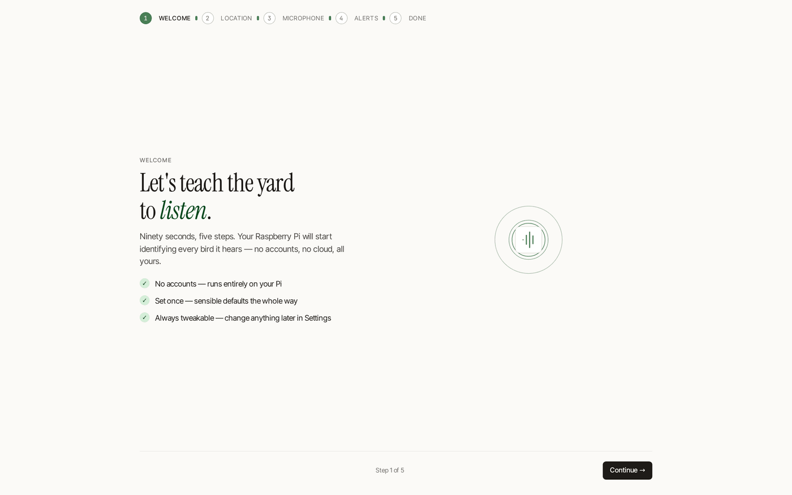

# First Steps

After starting (via the installer or Docker), open the web dashboard:

```text
http://<your-ip>:8502
```

> Not sure of your Pi's IP? Run `hostname -I` on the Pi, or check your router's device list.

If you set your latitude/longitude and an audio source, detections start appearing within a minute or two of the first bird call — no further configuration required.

## A two-minute tour

1. **Dashboard** (`/`) — the right-now view: a live detection feed, today's totals, top species, and an activity heatmap. See [The Dashboard](../guide/dashboard.md).
2. **Today** (`/today`) — a searchable, filterable log of everything heard today, with a 24-hour timeline. See [Today & the Detection Log](../guide/today.md).
3. **Species** (`/species`) and **Life List** (`/life-list`) — browse every species you've recorded and watch the list grow over the year. See [Species & the Life List](../guide/species.md).
4. **Admin → Settings** (`/admin/settings`) — optional fine-tuning: confidence threshold, per-species overrides, email, quarantine rules.

## First-run wizard

If you'd like a guided setup, open **`/onboarding`** for a five-step wizard — location, microphone, and alert preferences — that gets a new station listening in about ninety seconds.



## Health check

At any time you can run the built-in diagnostic, which prints a one-screen report covering CPU, configuration, audio reachability, the model file, database integrity, disk, and network — each problem with a concrete suggested fix:

```bash
# Bare metal
sudo -u birdnet birdnet-behavior --doctor

# Docker
docker compose exec birdnet birdnet-behavior --doctor
```

See [Troubleshooting](../guides/troubleshooting.md) if anything looks off.
