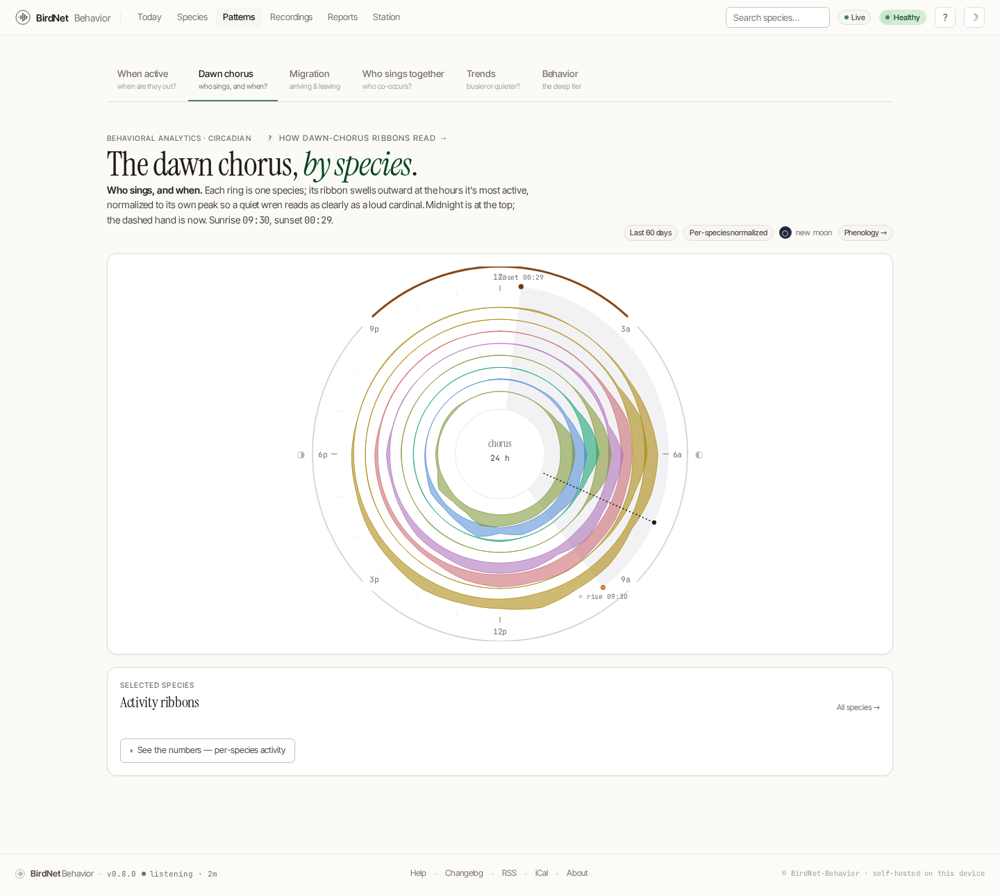

# The Dawn Chorus

The **Dawn chorus** tab of [Patterns](./patterns.md) (`/patterns?tab=dawn`) shows the daily *rhythm* of your yard: which species sing when, wrapped around a 24-hour clock and anchored to the real sunrise and sunset for your location.



## What you're looking at

- **The polar clock** plots detection activity around a 24-hour dial (midnight at the top, noon at the bottom). Each species is a coloured ribbon whose thickness tracks how often it was heard at that hour, so the pre-dawn build-up and the morning peak read at a glance.
- **Sunrise and sunset markers** are drawn from the station's coordinates, so the chorus lines up against actual first light rather than an arbitrary grid.
- **The right rail** lists the contributing species with their peak hour and total count.

## Setting your location

The sun-time overlay uses, in order of preference:

1. `BNB_STATION_LAT` / `BNB_STATION_LON` — set these in the environment for the most explicit control.
2. `BIRDNET_LATITUDE` / `BIRDNET_LONGITUDE` — the same coordinates used for BirdWeather and the recording scheduler.
3. A conservative `05:30` / `20:00` fallback if neither is configured.

```bash
# Example: a station near Boston, MA
BNB_STATION_LAT=42.3601
BNB_STATION_LON=-71.0589
```

## A note on time zones

Everything on this clock is in the station's **local** time: the ribbons are bucketed from the local hour in each recording's filename, and the sunrise/sunset markers are computed for your configured coordinates and then shifted into the same local frame. Set your station's timezone with `timedatectl set-timezone` (which is what `--doctor` checks) and set your coordinates on the Settings page — the two together are what makes the sun markers land where the sun actually was.

This page previously told you to run the station on UTC. That was advice for a defect, not a design: the markers were computed in UTC and drawn over local-time ribbons, so on any non-UTC station they were offset by the UTC difference, and they contradicted `--doctor`, which has always told operators to set their local timezone. The markers were additionally computed for a hard-coded (40.0 N, 74.0 W) unless two undocumented environment variables were set, on a day-of-year that drifted about a day a year. All three are fixed; run the station on its real timezone.

**No coordinates set?** The ribbons still draw — they need no location — but the sun markers and the night wedge are omitted rather than guessed. A sun drawn where your station is not would answer "does this species sing before sunrise?" wrongly while looking authoritative.

> Like the [migration](./phenology.md) view, this is built entirely from your own detections — no external data.
