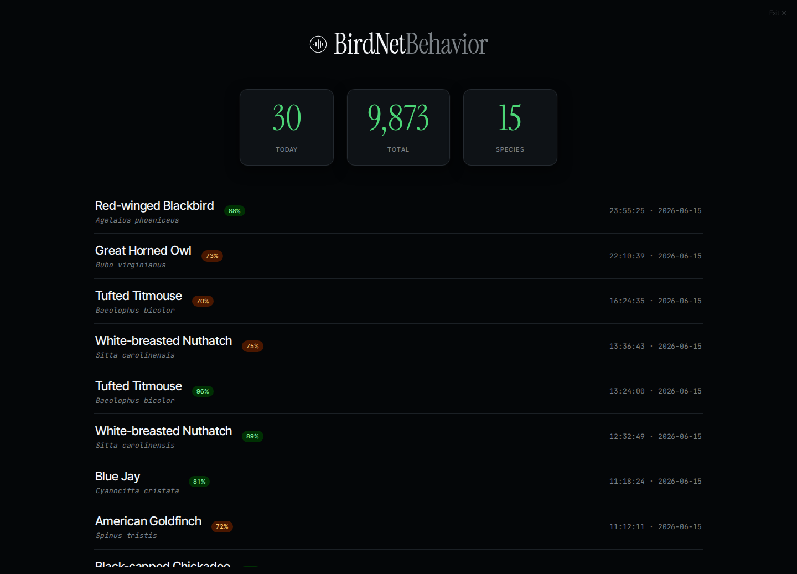

# Kiosk Mode

**Kiosk mode** (`/kiosk`) is a full-screen, auto-refreshing display for a wall-mounted screen — a Raspberry Pi touchscreen by the window, a spare monitor in the hallway, a TV in the visitor center.

It strips away the navigation chrome and shows the numbers that read from across the room — today's count, the all-time total, species, and a stream of the most recent detections — refreshing on its own so it never goes stale.

To leave kiosk mode, click the dimmed **Exit** link in the top-right corner, or press **Esc** — either returns you to the full dashboard. (The link stays faint so it never competes with the display, and brightens on hover.)

## Tips for a dedicated display

- Point a full-screen browser at `http://<your-pi>:8502/kiosk`.
- Kiosk mode defaults to the dark "observatory" theme, which is easy on the eyes for an always-on screen and avoids burn-in on OLED panels.
- On Raspberry Pi OS, Chromium's `--kiosk` flag plus the URL is all you need in an autostart entry.

> For an always-on Pi display, make sure a system CJK font (e.g. `fonts-noto-cjk`) is installed if you expect non-Latin species names — the dashboard itself ships all its Latin fonts self-hosted and never calls out to a font CDN.
