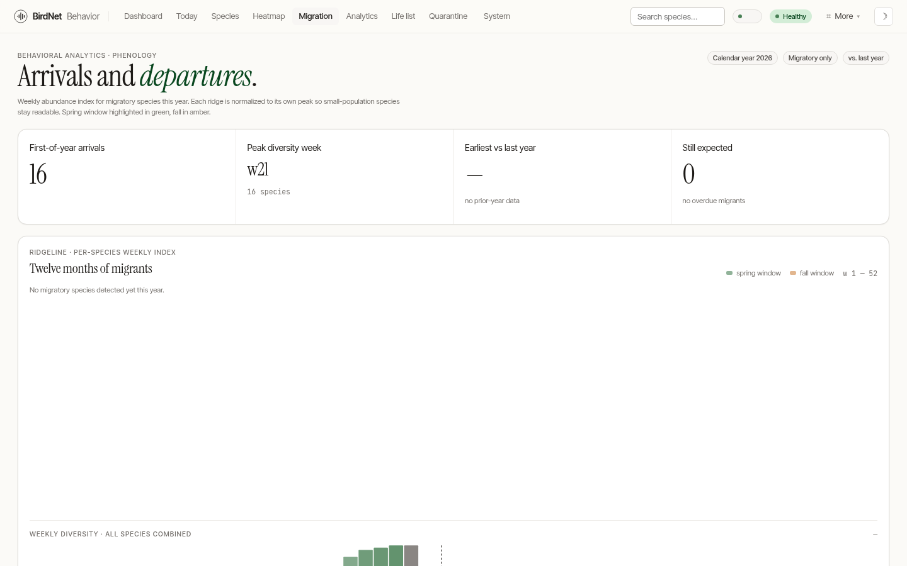

# Migration & Phenology

The **Migration** tab of [Patterns](./patterns.md) (`/patterns?tab=migration`) turns a year of detections into a picture of *when* each species moves through your yard. It's the seasonal companion to [Today](./today.md)'s right-now view: instead of "what's singing this minute?", it answers "who has arrived, who's peaking, and who's overdue?"

## What you're looking at

- **Four KPI tiles** across the top:
  - **First-of-year arrivals** — species whose first-ever detection at the station falls in the current year.
  - **Peak diversity week** — the calendar week with the most distinct species so far.
  - **Earliest vs last year** — of the species heard in both this year and last, the one that turned up earliest relative to its previous arrival, in days (a negative number means earlier than last year).
  - **Still expected** — species that arrived around now in the prior year but haven't been logged yet this year.
- **The ridgeline** ("joyplot") is the heart of the page: one normalized curve per migratory species, stacked and ordered by peak week, with spring- and fall-migration bands shaded behind them and a dashed "today" marker. Each ridge is labelled with the species' four-letter banding code and its peak week.
- **The diversity strip** along the bottom shows distinct-species-per-week as a bar chart, tinted for the spring and fall windows.
- **Editorial cards** call out what *just arrived* and what's *currently peaking*.

## How a species qualifies as "migratory"

The ridgeline uses a deliberately cheap heuristic on the current year's data: a species is treated as migratory when its busiest week is several times its median active week (a sharp seasonal pulse) and it has been heard across at least four weeks. Year-round residents — which detect at a steady level — are filtered out so the plot stays about movement, not abundance. Early in the year the page is naturally sparse; it fills in as the season progresses.

> This is a station-local view built entirely from your own `detections` table — no external range maps. It reflects what *your* microphone hears, which is exactly the point.

## Not the same as "Migrating from BirdNET-Pi"

This page is about bird migration through your yard. If you're looking to **import data from an existing BirdNET-Pi install**, that's a different feature — see [Migrating from BirdNET-Pi](../guides/migration.md) and the `/admin/migrate` admin page.
