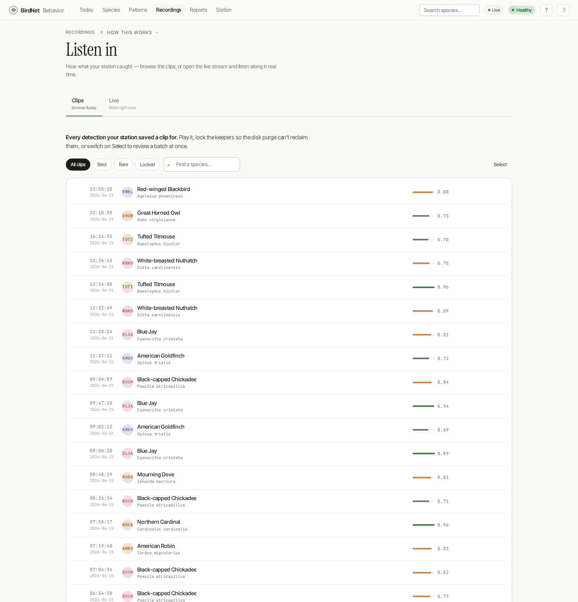
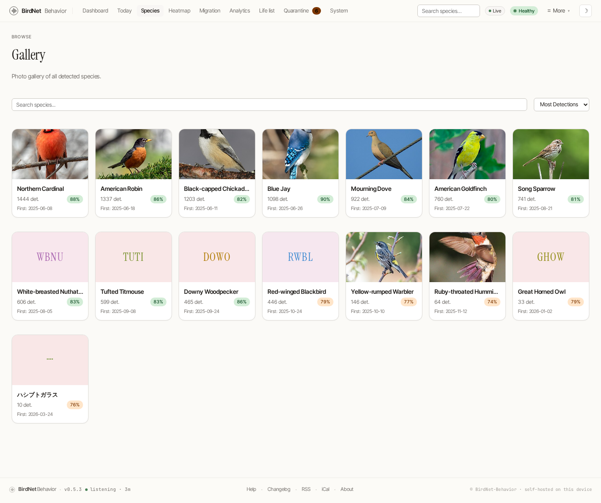

# Recordings & Live Audio

**Recordings** (`/recordings`) is the audio home — both the saved clips and the
live stream.

## Recordings browser

The **Recordings** home (`/recordings`) lets you listen back to detection clips, browsing **by species** or **by date**.

Pick a species (each row carries its banding-code avatar and all-time count) to see its clips, then play any recording inline. Clips you've **locked** on [Today](./today.md) are protected from disk purges and surface here too.

## Live audio

Open the live stream (`/listen`) to listen along with your station in real time — a per-source audio player and a scrolling spectrogram, with a live trickle of detections as they're classified. The spectrogram is **honest**: it scrolls only while audio is arriving and shows a flat baseline otherwise, never a fake waveform. Today's live-signal card links straight here, and you can preselect a microphone with `/listen?source=<id>`.

## Species photos

The species **Gallery** now lives as the **Photos** view of the
[Species](./species.md) home (`/species?view=photos`) — a photo-card grid of
every detected species, searchable and sortable. The standalone `/gallery`
address still works.

Each card shows the species photo (cached from Wikipedia, with attribution), the common and scientific name, the detection count, and a confidence pill. Species without a cached photo fall back to an on-brand placeholder tinted in the species' own color and stamped with its banding code — so the grid stays cohesive even before images load.

> All bird photos are cached locally from Wikimedia Commons under CC BY-SA, and the attribution is shown on each image as the license requires.
