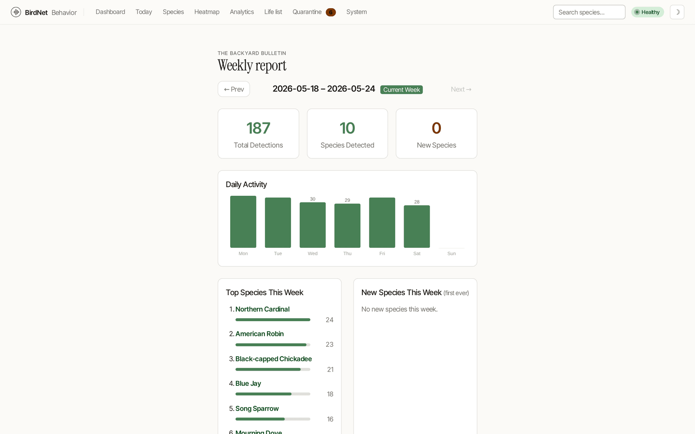
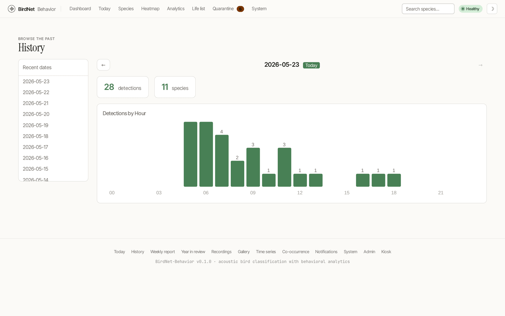

# Reports

BirdNet-Behavior turns your data into editorial recaps you'd actually want to read.

## Weekly report

The **Weekly Report** (`/weekly`) is a Sunday-paper recap of the week — total detections, species count, new arrivals, a daily-activity chart and the week's leaderboard. Navigate between weeks with the prev/next controls.

## Year in Review

The **Year in Review** (`/year-in-review`) is a celebratory annual recap:

- a cinematic display headline and four big-number tiles (detections, species, days listening, busiest day),
- a **52-week activity tape** — one moss-intensity cell per week — that shows the year's rhythm at a glance,
- the year's species leaderboard with banding-code avatars,
- a milestones strip (first voice of the year, most-heard species, busiest day, newest arrival),
- and a closing tally.

## History calendar

The **History** page (`/history`) is a calendar browser. Each day tile is intensity-coded by detection count; select a day to see its hourly activity and top species.

