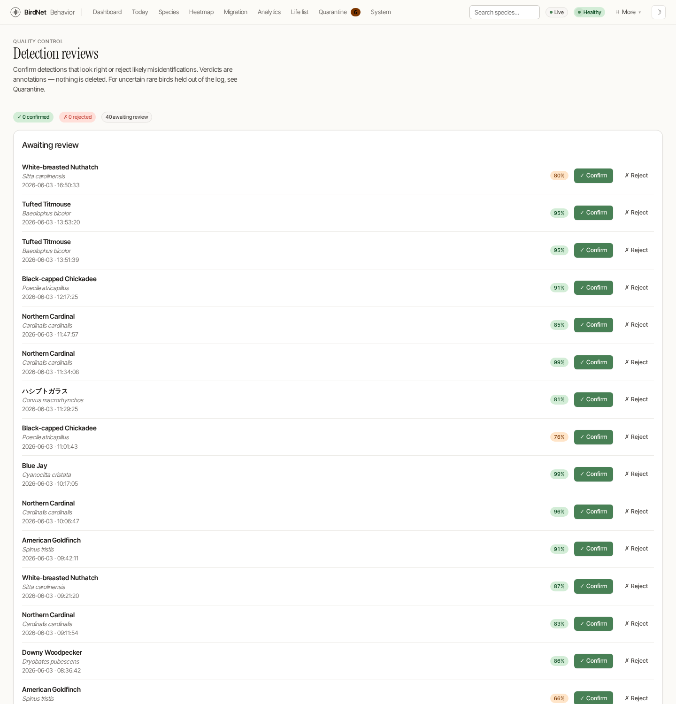

# Reviewing Detections

BirdNet-Behavior classifies every clip automatically, but you are the final
arbiter. The **detection-review** queue lets you record a verdict —
*confirmed* or *rejected* — on individual detections, building a clean,
human-checked record over time.

## Reviews vs. quarantine

These are two different quality-control surfaces; it helps to keep them straight:

| | [Quarantine](../admin/settings.md) | Detection reviews |
|---|---|---|
| **What it holds** | Detections that *failed* a stricter per-species threshold | Detections already admitted to the log |
| **Effect** | Gates rows *out* of `detections` until you approve them | A non-destructive annotation; nothing is moved or deleted |
| **Verdict** | Approve / Reject / Delete | Confirm / Reject (reversible) |
| **Use it to** | Vet uncertain rare birds before they count | Audit the ID quality of detections that already count |

A *rejected* review flags a likely misidentification for your own records — it
does **not** remove the detection. Quarantine is the tool for keeping a dubious
record out of the log entirely.

## The triage queue (`/detection-reviews`)

The queue lists recent detections that have **no verdict yet**, newest first,
each with its species, time, and confidence. Two buttons record a verdict:

- **✓ Confirm** — the identification looks right.
- **✗ Reject** — likely a misidentification.

A running tally at the top shows how many detections you have confirmed,
rejected, and have left to review. Recorded verdicts move to the **Recent
verdicts** list, where an **Undo** button clears a verdict and returns the
detection to the queue. Re-reviewing a detection simply replaces its previous
verdict — there is never more than one verdict per `(date, time, species)`.

## Reviewing from a detection

You don't have to work the queue to leave a verdict. Every
[detection-detail page](./sharing.md) carries a **Review this detection**
widget with the same Confirm / Reject buttons and a badge showing the current
verdict, so you can judge a clip the moment you're looking at it — spectrogram,
audio and all.

## Sharing a detection for a second opinion

Not sure about a call? Both the detection-detail page and every row in the
[quarantine queue](../admin/settings.md) have a **Share** button that copies a
public [`/r/<token>` link](./sharing.md#share-links-rtoken). The share page
resolves quarantined rows too, so you can send a rare bird that hasn't been
admitted to the log to another birder for a second opinion before you decide.
