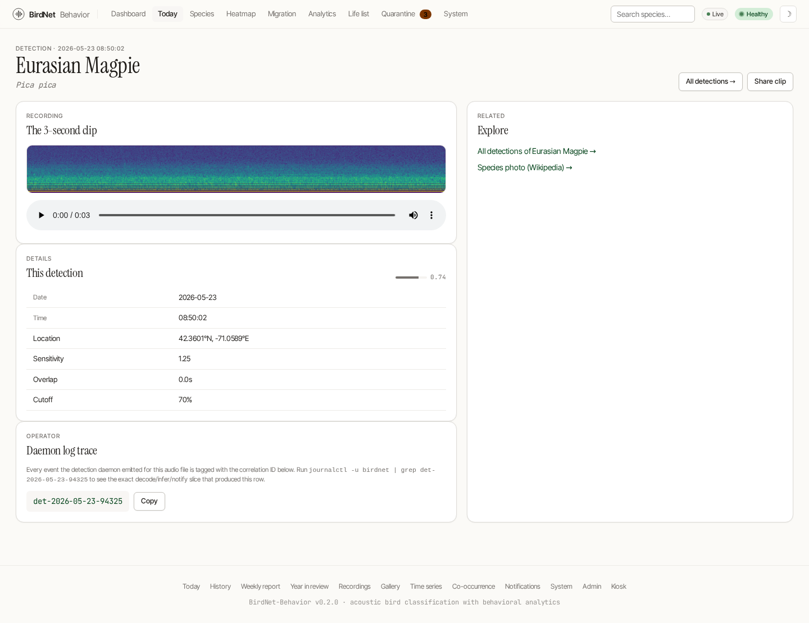
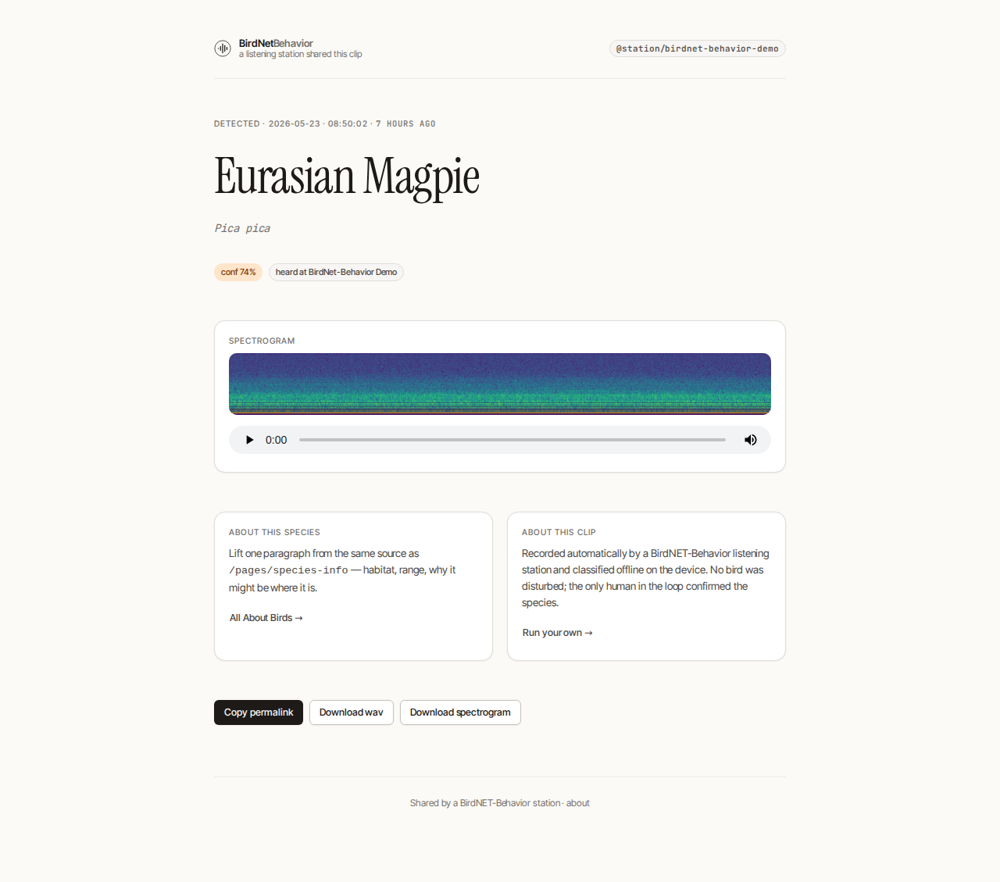

# Detection Detail & Share Links

Every detection in the app — a feed row on the [dashboard](./dashboard.md), an entry on [Today](./today.md), a point in a chart — links through to a **detail page** that shows everything known about that one moment, and lets you hand it to someone else with a single public link.



## The detail page

`/detections/detail?date=…&time=…&name=…` is the canonical detail view. A detection has no numeric id; it is identified by the `(Date, Time, Com_Name)` triple, which is what the route's three query parameters carry.

It shows:

- the species (common + scientific name), confidence, and exact timestamp;
- the **3-second clip**, rendered as both a spectrogram image and an inline audio player, when a recording is on disk for that detection;
- the **correlation id** the detection daemon stamped on every log line, DB write and notification for the source file — copy it and `grep` your logs to pull the exact decode→infer→notify slice that produced the row;
- a **Share clip** button.

## Share links (`/r/<token>`)

The **Share clip** button copies a public, self-contained URL of the form `/r/<token>` to your clipboard. Anyone with the link sees a clean, single-detection page — species, time, spectrogram and audio — with no navigation into the rest of your station and no login.



How the token works:

- It encodes `(date, time, com_name, expiry)` and a truncated **HMAC-SHA256** signature, base64url-encoded. Links default to a **30-day** lifetime.
- Verification is **constant-time**. A tampered or expired token renders a neutral "This clip is gone" page (HTTP 404, `noindex`) that leaks nothing about whether the detection exists.
- `/r/<token>/audio.wav` and `/r/<token>/spectrogram.png` resolve the recording by **filename** and `302`-redirect to the normal media routes, so the clip and spectrogram render without exposing any internal id.

### `BNB_SHARE_SECRET` — set it in production

Tokens are signed with `BNB_SHARE_SECRET`:

```bash
# 32+ random bytes; keep it stable so issued links survive restarts
BNB_SHARE_SECRET="$(openssl rand -base64 48)"
```

If the variable is **unset**, the station falls back to a random per-process secret and logs a warning. That is *fail-secure* — every previously issued link is invalidated the moment the process restarts — but it means share links won't survive a reboot. Set `BNB_SHARE_SECRET` to a stable random value on any station you actually share from.

> Share links are deliberately read-only and scoped to one detection. They are not affected by — and do not bypass — the admin password or any reverse-proxy auth in front of the main UI.
