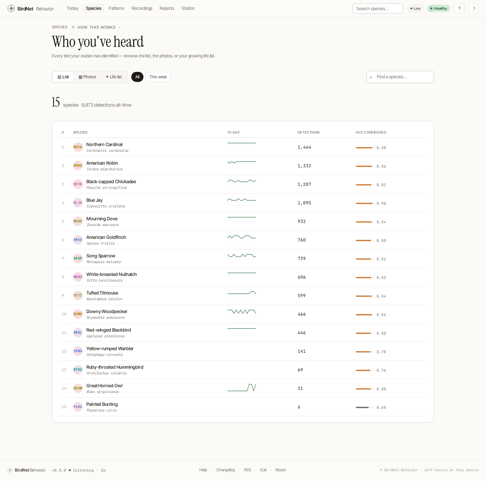
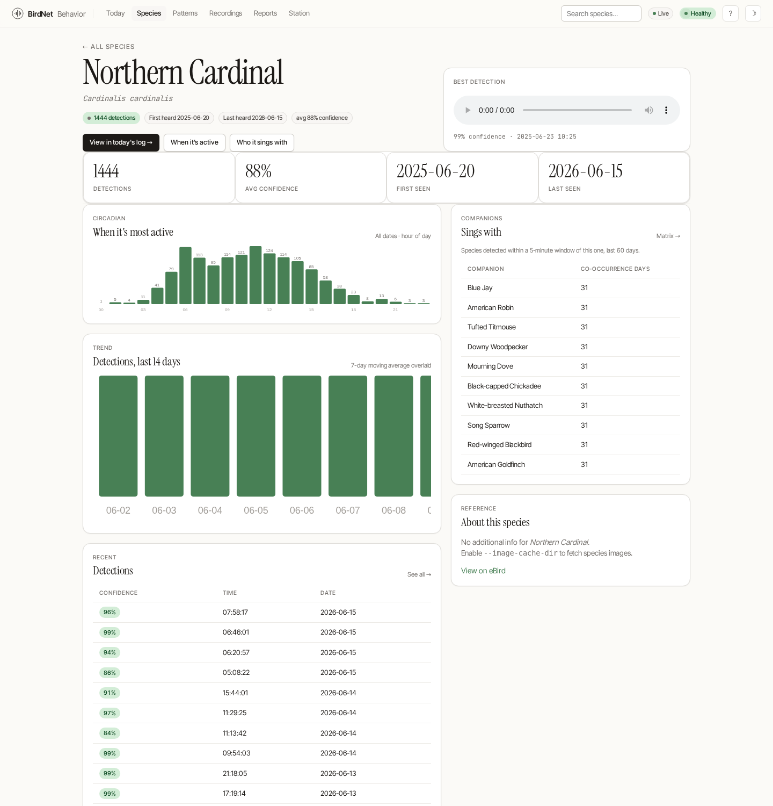
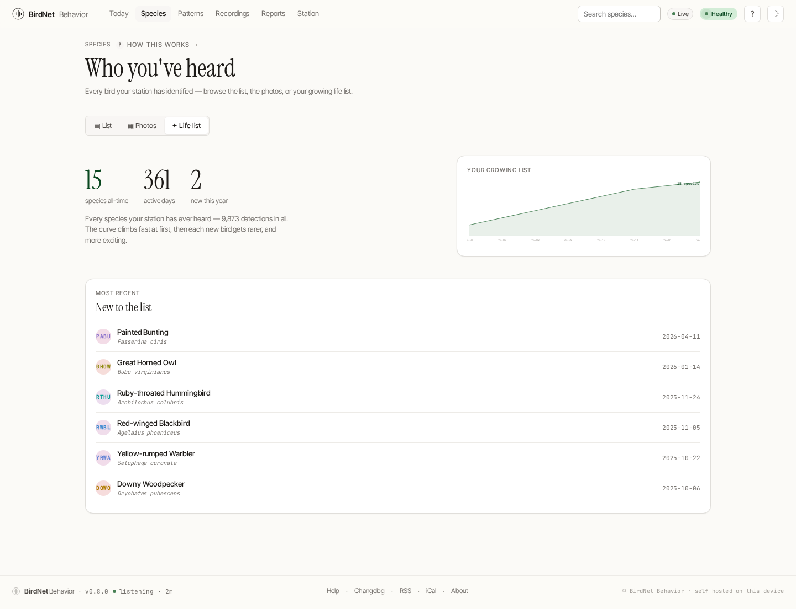

# Species & the Life List

## Species list

The **Species** page (`/species`) is the browsable index of every bird you've recorded — searchable and sortable by most-heard, A→Z, or newest.

Each row carries the species avatar, common and scientific name, all-time count, a 14-day sparkline, average confidence, and first/last-heard dates.

## Species detail

Click any species for its detail page (`/species/detail?name=…`): a full-bleed Wikipedia photo, the scientific name and description, an hourly activity profile, a multi-week activity grid, companion species (the birds it's most often heard alongside), and a strip of recent recordings.

## Life list

The **Life List** (`/species?view=lifelist` — the old `/life-list` still redirects in) is your birding journal — every species, once. It leads with three tallies (species, total detections, active days) and a smooth **accumulation curve** showing the list growing over the year, then a per-month "new species" chart and the full ranked table with average-confidence pills.

> Confidence pills are color-coded — moss for high-confidence species, dawn (amber) for the more tentative ones — so the quality of each entry reads at a glance.
