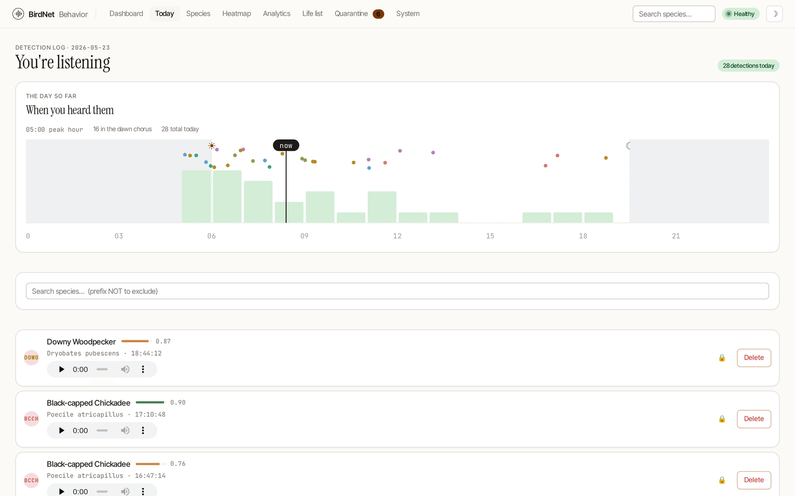
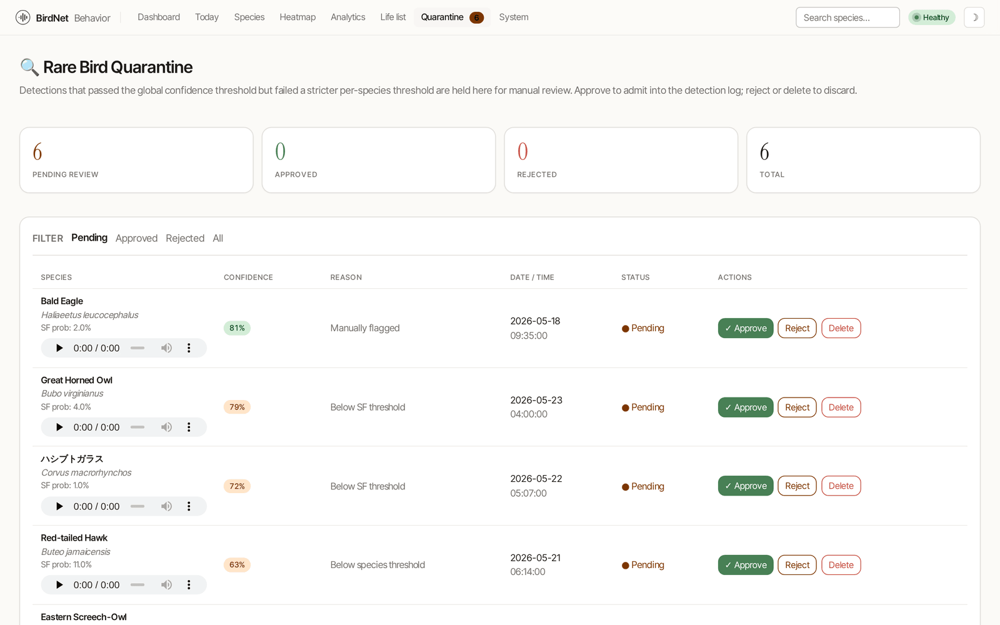

# Today & the Detection Log

The **Today** page (`/today`) is the searchable, filterable log of everything heard since midnight.

## The DayStrip

At the top, the **DayStrip** plots the whole day on a single 24-hour timeline:

- night bands flank sunrise and sunset,
- an hourly histogram shows how busy each hour was,
- every detection is a dot placed by time (x) and confidence (y), colored by species,
- a "now" marker tracks the current moment.

A one-line caption summarizes the peak hour, the dawn-chorus count, and the day's total.

## The log

Below the strip, each detection is a row with its avatar, name, confidence and an inline player. You can:

- **search** by species name (prefix with `NOT` to exclude),
- **play** the clip without leaving the page,
- **lock** a detection so its recording survives disk purges,
- **re-label** a misidentified call, or
- **delete** a false positive.

The list auto-refreshes, so a page left open keeps current.

## Rare-bird review queue

Detections that clear the global confidence threshold but fail a stricter per-species check land in the **Quarantine** queue (`/quarantine`) for manual review rather than polluting your life list.

Each pending detection shows its confidence, the reason it was held (below species-frequency threshold, low confidence, or manually flagged), and **Approve / Reject / Delete** actions. Approving admits it into the detection log; rejecting or deleting discards it. Configure the rules under [Settings → Species](../admin/settings.md).
