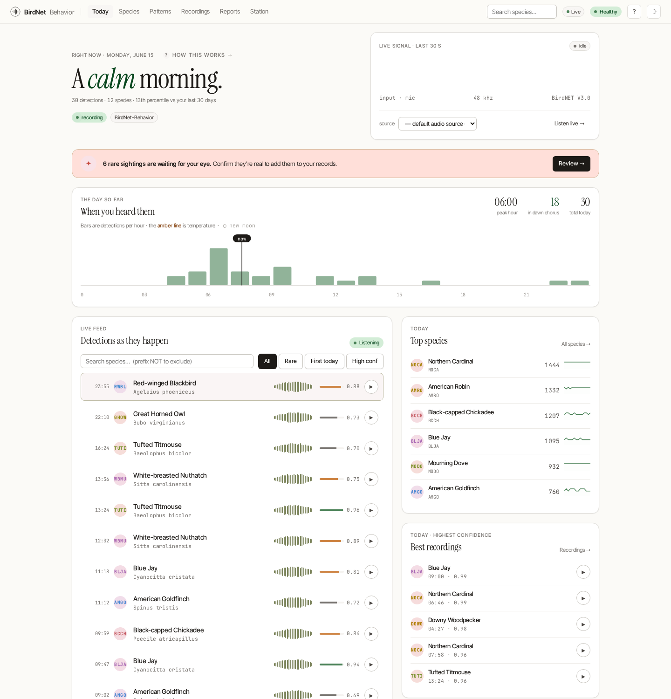
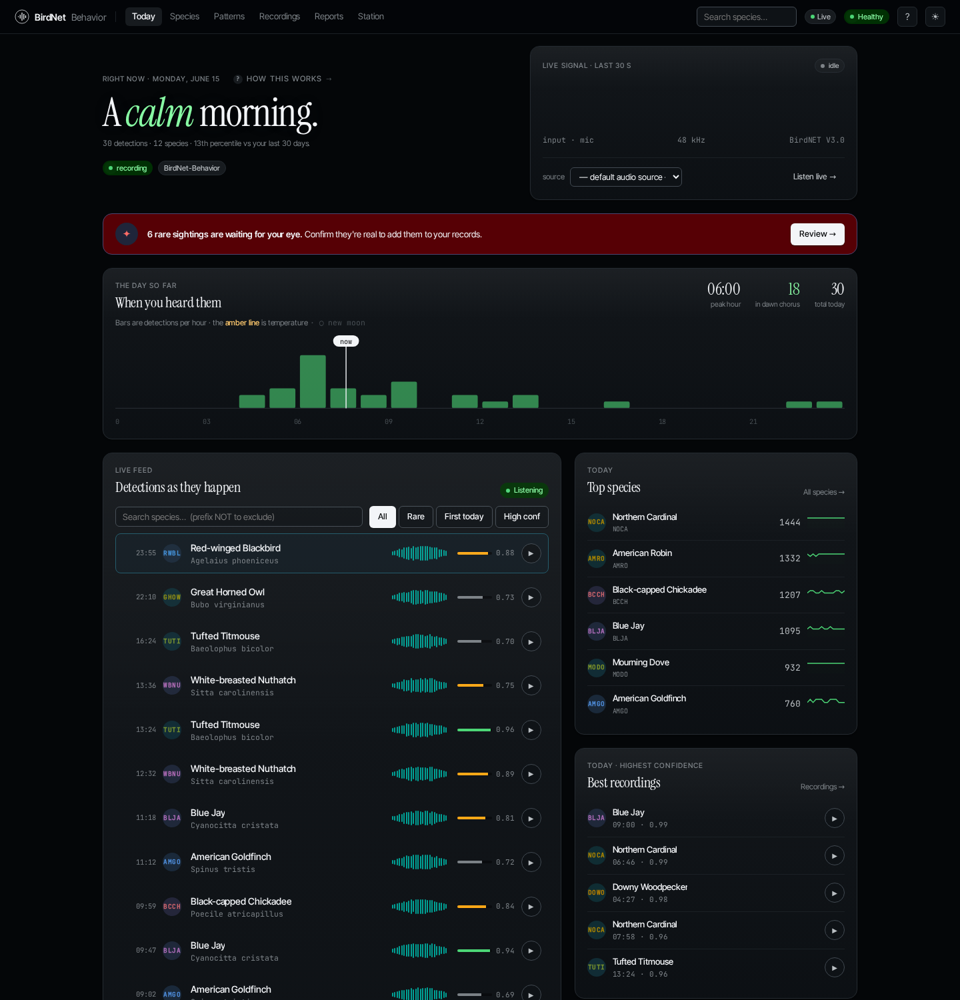

# BirdNet-Behavior

**Real-time acoustic bird classification with behavioral analytics — written in Rust, runs on a Raspberry Pi.**

BirdNet-Behavior listens to your microphone or RTSP camera, identifies birds in real time with the BirdNET+ neural network, and serves a fast, beautiful web dashboard you open in any browser. It ships as **one self-contained binary** — the ONNX Runtime and DuckDB analytics engine are compiled in, so there's no Python, no `pip`, no virtualenv. Drop it on a modern 64-bit Pi and run it.

## Where to start

| If you want to… | Go to |
|---|---|
| Get it running in two commands | [Installation](./getting-started/installation.md) |
| Run it in a container | [Running with Docker](./getting-started/docker.md) |
| Understand the settings | [Configuration](./getting-started/configuration.md) |
| Learn what each screen does | [Today](./guide/today.md) |
| Move from BirdNET-Pi | [Migrating from BirdNET-Pi](./guides/migration.md) |
| Fix a problem | [Troubleshooting](./guides/troubleshooting.md) |

## Why a rewrite?

BirdNet-Behavior is a ground-up Rust rewrite of [BirdNET-Pi](https://github.com/mcguirepr89/BirdNET-Pi). It keeps everything BirdNET-Pi does and adds behavioral analytics, a redesigned UI, MQTT/Home Assistant integration, and a much lighter runtime.

| | BirdNET-Pi (Python) | BirdNet-Behavior (Rust) |
|---|---|---|
| Runtime | CPython interpreter + virtualenv | One native binary — no interpreter |
| Install | `pip` into a venv + system packages | one file, or one `curl` installer |
| Upgrade | re-resolve pip dependencies | replace one file |
| Inference | TensorFlow Lite (Python) | ONNX Runtime, linked in-process |
| Analytics | — | DuckDB behavioral engine, built in |
| Each release ships | — | signed SLSA provenance + CycloneDX SBOM |

> It is a **clean rewrite, not a fork.** See [Credits & License](./about.md) for full attribution.

## A modern, two-audience interface

The UI is organized into **six homes** — the tabs across the top, and the
phone bottom bar:

| Home | "…" |
|---|---|
| **Today** | what's happening right now? |
| **Species** | who have I heard? |
| **Patterns** | when & where? |
| **Recordings** | let me hear them |
| **Reports** | the recap |
| **Station** | manage my station |

Every screen is designed to serve two people at once: the **hobbyist** who wants a delightful at-a-glance view, and the **researcher** who needs methodological rigor. Each page leads with a plain-English headline, then layers the dense numbers and charts beneath. The whole UI supports light and dark themes (with automatic OS-preference detection) and reflows cleanly from a wall-mounted kiosk down to a phone.

Read on for [installation](./getting-started/installation.md), or jump into the [field guide](./guide/today.md) for a tour of every screen.
